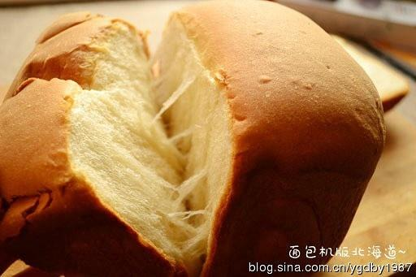

# 北海道吐司

## 📋 基本資訊 / Recipe Overview
- **料理名稱**：北海道吐司
- **原始標題**：北海道吐司
- **素食流派 / Diet**：蛋奶素 Ovo-Lacto
- **料理分類 / Category**：面食主食
- **來源平台 / Source**：[下廚房 · 素食主義專區](https://www.xiachufang.com/recipe/212748/)

## 🌿 食材及佐料清單 / Ingredients
- 250g高粉
- 70g动物性鲜奶油
- 20g蛋白
- 8g细砂糖
- 1.5g速溶酵母
- 80g鲜奶
- 10g黄油
- 20g蛋白
- 35g细砂糖
- 3g盐
- 1g速溶酵母
- 15g奶粉
- 10g黄油

## 🍳 烹飪步驟 / Step-by-Step Cooking Steps
1. 把中种材料（用料1）按顺序放入面包桶内，先放入液体类的牛奶、奶油和蛋白
2. 把糖和融化的黄油分别放在面包桶的两角
3. 放入高筋面粉，在面粉上挖一个小窝，放入耐高糖干酵母
4. 启动面包机，选择响应的程序，开始揉面，成团后停止。(以我的柏翠PE8200为例，选择程序6的和面程序，揉至所有材料成团即可关掉面包机。）
5. 揉好的面团即为中种，发酵至2倍大。（可以选择发酵程序快速发面。如果家里温度高，也可以包上保鲜膜或湿布，放在室温下发酵，时间紧张的上班族，可以前一天晚上把面团放进冰箱冷藏一夜，第二天拿出来继续操作，不但可以节省时间，面包风味也会更好一些。）
6. 发酵好的中种不需要排气，直接撕成小块，放入面包桶内
7. 把主面团（用料2）的材料也投入面包桶（但要注意，盐和酵母要分开放，不要混在一起，盐会抑制酵母的发酵）
8. 启动程序6，揉15分钟后自动停止。（这时检查一下面团的状态，如果可以拉出薄膜，但薄膜还不是很结实，有不规则破洞，就可以加黄油了）
9. 加入软化的黄油，视面团的情况
10. 用程序6继续搅拌10-15分钟，能达到完全阶段即可
11. 拉开面团，可以得到较结实的大片薄膜
12. 其实揉好的面团，可以直接发酵烘烤了
13. 如果有时间的话，可以跟我一样，把面团拿出来擀卷后再放入
14. 做法就是把面团分成2份或三份，滚圆后擀成长条
15. 卷起后再次擀长，再次卷起，捏好接缝的位置，放入面包桶内即可
16. 启动9，是专门的发酵程序，时间默认2个小时。（这时可以干别的去了，发酵完成后会自动停止并鸣笛提醒。）
17. 发酵完成后就可以烘烤了，选择程序12，也就是烘烤程序，时间设定为40分钟。（烘烤完成后要立马取出面包桶，脱模后冷却，不要长时间的放在面包机内，也不要吃刚出炉的热面包，对胃不好。注意取出时不要烫到，要戴上防热手套哈）

---
*食譜歸檔時間：2026-08-20 · 來源：下廚房 (www.xiachufang.com)*