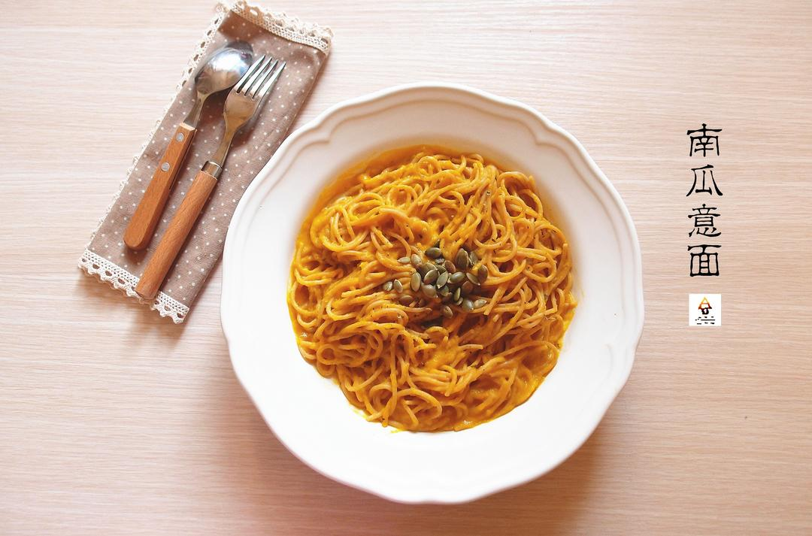

# 南瓜意面 Spaghetti with Pumpkin Sauce

## 📋 基本資訊 / Recipe Overview
- **料理名稱**：南瓜意面 Spaghetti with Pumpkin Sauce
- **原始標題**：南瓜意面(Spaghetti with Pumpkin Sauce)
- **素食流派 / Diet**：全素 Vegan
- **料理分類 / Category**：面食主食
- **來源平台 / Source**：[下廚房 · 素食主義專區](https://www.xiachufang.com/recipe/100035165/)

## 🌿 食材及佐料清單 / Ingredients
- 一人份有机全麦意大利面
- 半个小南瓜
- 两大匙椰浆
- 一大匙橄榄油
- 1/2小匙+10克海盐
- 少许意大利混合香料
- 适量生南瓜籽

## 🍳 烹飪步驟 / Step-by-Step Cooking Steps
1. 南瓜去皮去籽切薄片，上蒸锅大火蒸约五分钟至熟透，取出放凉后连蒸出来的水一起用搅拌机打成泥；
2. 南瓜籽放入无油平底锅，中小火炒熟（外型变小变黄）后盛出待用；将约10克的海盐一起放入烧好约1L水的大锅中，然后放入意大利面煮到九成熟后捞出来待用；
3. 锅烧热橄榄油，倒入椰浆，南瓜泥中小火拌匀，如果是浓椰浆可加一点水后拌匀，放入1/2小匙的盐炒匀，迅速放入意面后和酱汁拌匀即可，盛盘后在表面撒上熟南瓜籽和意大利综合香料

## 💡 大廚美味秘訣 / Chef's Tips
- 金秋的应季食物好多都是金色的 
抓紧机会吃最新鲜的根茎类植物吧！ 
先王婆卖瓜一下 
这个南瓜意面被杰利评价为“吃过最好的意面” 
连对意面从来都不满意的我也忍不住给自己打个高分 
让它顺利过关进入我的保留食谱 
不需要帕玛森干酪、奶油、洋葱和大蒜 
意大利面也可以又健康又好吃

---
*食譜歸檔時間：2026-08-20 · 來源：下廚房 (www.xiachufang.com)*