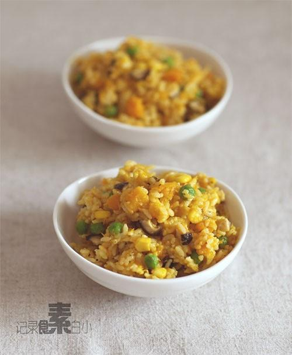

# 南瓜酱炒饭

## 📋 基本資訊 / Recipe Overview
- **料理名稱**：南瓜酱炒饭
- **原始標題**：南瓜酱炒饭
- **素食流派 / Diet**：全素 Vegan
- **料理分類 / Category**：面食主食
- **來源平台 / Source**：[下廚房 · 素食主義專區](https://www.xiachufang.com/recipe/1002210/)

## 🌿 食材及佐料清單 / Ingredients
- 米饭
- 南瓜
- 青豆
- 玉米粒
- 香菇
- 盐
- 黑胡椒粉

## 🍳 烹飪步驟 / Step-by-Step Cooking Steps
1. 南瓜洗净，去皮去瓢切成1厘米左右的丁待用
2. 香菇去蒂切丁，速冻的青豆玉米粒解冻
3. 锅烧热下少许油，下南瓜丁炒匀加水没过南瓜，小火煮至水收了一半
4. 用勺子压碎一半的南瓜，加入青豆玉米香菇同炒，加盐黑胡椒粉调味
5. 加入米饭一起炒匀即可出锅

## 💡 大廚美味秘訣 / Chef's Tips
- 这道炒饭做的最频繁，以至于一直没想起来拍照发博 
 朋友们来吃饭也经常是炒一大锅，吃不了兜着走带便当上班吃 
少废话上做法

---
*食譜歸檔時間：2026-08-20 · 來源：下廚房 (www.xiachufang.com)*