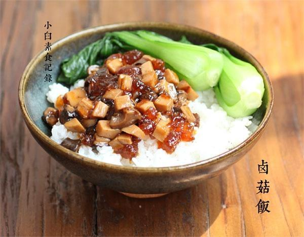

# 卤菇饭

## 📋 基本資訊 / Recipe Overview
- **料理名稱**：卤菇饭
- **原始標題**：卤菇饭
- **素食流派 / Diet**：全素 Vegan
- **料理分類 / Category**：米食主食
- **來源平台 / Source**：[下廚房 · 素食主義專區](https://www.xiachufang.com/recipe/1049299/)

## 🌿 食材及佐料清單 / Ingredients
- 10朵新鲜香菇
- 2个杏鲍菇
- 5朵干香菇
- 20粒左右桃胶
- 2片生姜
- 一个八角
- 2个干辣椒
- 2大匙生抽
- 1大匙老抽
- 五六颗冰糖
- 1小匙盐
- 三大碗米饭
- 六棵小油菜

## 🍳 烹飪步驟 / Step-by-Step Cooking Steps
1. 新鲜杏鲍菇和香菇洗净去蒂，切小丁待用。干香菇提前用水泡发，留下泡香菇的水，也去蒂切丁。桃胶提前12小时泡发，揪成小块待用
2. 干香菇因为有杂质，所以泡香菇的水需要过滤一下或者静置沉淀，把上面的部分到处来用，沉淀有杂质的部分扔掉。
3. 锅烧热下2大匙油，下生姜八角辣椒小火煸香，然后下入切好的杏鲍菇和干鲜香菇不断翻炒，直到炒到蘑菇出水，接着再翻炒一会，加入泡好的桃胶炒匀，加入泡香菇的水一碗，再加白水适量刚刚没过锅里的菜。然后下冰糖、老抽、生抽炒匀，小火慢卤20分钟至半个小时（期间不时翻炒，防止粘锅）尝味后根据情况可加少许盐，大火收一下汁，不要收干，留些汁拌饭，关火待用
4. 小油菜洗净，锅中烧开水，下一点盐，下入油菜烫30秒捞出过凉水，然后沥干水分待用
5. 取一只碗盛满米饭，浇上卤菇，旁边摆上小油菜即可

## 💡 大廚美味秘訣 / Chef's Tips
- 素食卤菇饭，在京兆尹吃到放了桃胶的卤菇饭，口感超棒，偷师做了一个在家可以简单操作的~桃胶吸足了汤汁非常美味 
桃胶就是桃树分泌的树脂，富含胶质，和血益气~淘宝有卖，请自行搜索 
以下是3人份，请酌情按比例增减 
1大匙=1汤匙=15ml 
1小匙=1茶匙=5ml

---
*食譜歸檔時間：2026-08-20 · 來源：下廚房 (www.xiachufang.com)*