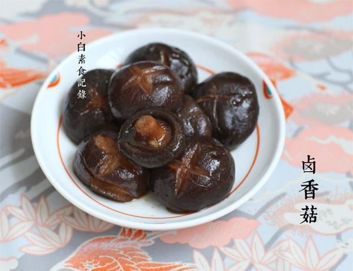

# 卤香菇

## 📋 基本資訊 / Recipe Overview
- **料理名稱**：卤香菇
- **原始標題**：卤香菇
- **素食流派 / Diet**：全素 Vegan
- **料理分類 / Category**：家常蔬食 / 经典热菜
- **來源平台 / Source**：[下廚房 · 素食主義專區](https://www.xiachufang.com/recipe/1045518/)

## 🌿 食材及佐料清單 / Ingredients
- 300g小香菇
- 2片生姜
- 一块桂皮
- 一个八角
- 1/2小匙丁香
- 1大匙冰糖
- 1小匙老抽
- 1小匙盐

## 🍳 烹飪步驟 / Step-by-Step Cooking Steps
1. 新鲜香菇洗净切掉蒂（如果是干香菇就要提前泡发反复洗净），调料准备好
2. 香菇用刀子刻花或者直接划十字，以便更好的入味
3. 锅烧热下一点点油，下入姜桂皮八角丁香小火煸出香味，然后下处理好的香菇翻炒一下，接着加入没过香菇的水和其他所有调料，大火烧开后转小火卤半小时
4. 吃的时候淋上一点香油即可，冷热均佳

## 💡 大廚美味秘訣 / Chef's Tips
- 新鲜香菇和干香菇都可以做这道菜，干香菇的味道更浓郁，新鲜香菇的口感更好，不过用干香菇有一个缺点就是容易洗的不够干净会牙碜~

---
*食譜歸檔時間：2026-08-20 · 來源：下廚房 (www.xiachufang.com)*