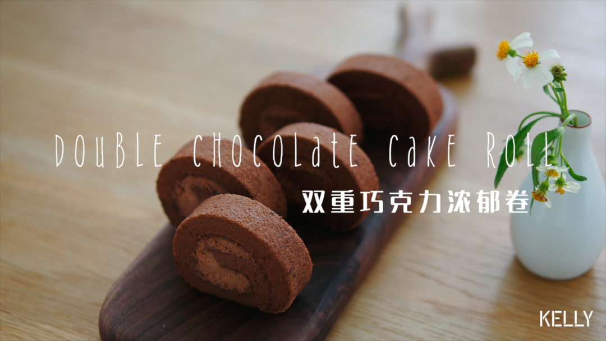

# 双重巧克力浓郁卷 香香香香···香喷喷的巧克力卷~ 烘焙视频蛋糕篇10「中卷」

## 📋 基本資訊 / Recipe Overview
- **料理名稱**：双重巧克力浓郁卷 香香香香···香喷喷的巧克力卷~ 烘焙视频蛋糕篇10「中卷」
- **原始標題**：双重巧克力浓郁卷/香香香香···香喷喷的巧克力卷~/烘焙视频蛋糕篇10「中卷」
- **素食流派 / Diet**：蛋奶素 Ovo-Lacto
- **料理分類 / Category**：面食主食
- **來源平台 / Source**：[下廚房 · 素食主義專區](https://www.xiachufang.com/recipe/102418992/)

## 🌿 食材及佐料清單 / Ingredients
- #真巧克力蛋糕胚（28*28cm）#
- 4个鸡蛋
- 55g牛奶
- 50g植物油
- 60g低筋面粉
- 15g可可粉
- 60g细砂糖
- 1g（1/4小勺）盐
- 25g黑巧克力
- #巧克力奶油#
- 150g淡奶油
- 10g细砂糖
- 30g黑巧克力

## 🍳 烹飪步驟 / Step-by-Step Cooking Steps
1. 提早一天制作巧克力奶油。
使用微波炉操作方便快捷，如果没有，请按此配方根据「巧克力奶油蛋糕」步骤制作巧克力奶油。
2. 淡奶油放在可入微波炉的容器内，加入细砂糖。
3. 加入巧克力。
4. 晃一晃，让淡奶油没过巧克力。
5. 盖上盖子。
6. 中火微波30秒左右。
用手触摸杯壁，微微温热（不是很热）就好了。
千万不要加热过度。
如果没有把握，最好10秒钟一次，取出来感觉一下温度。
外壁温热，说明奶油在30-40℃之间，恰好是巧克力溶解的温度。
7. 趁热搅拌至砂糖和巧克力都融化掉。
8. 盖好，冷藏一夜备用。
冷藏不可以省略。
9. 第二天我们来烤蛋糕。
植物油和牛奶一起倒入奶锅，一边搅拌一边小火（注意！是小火！）加热10-15秒。
10. 摸摸锅壁有一点点烫就关火。
这个时候，液体温度在45-50℃之间。
千万不要加热到开始冒泡快沸腾，我们只是温一下奶方便溶解融化啊~
11. 如果你的锅很薄（冷却速度快），那么可以直接筛入可可粉。
像我这种厚锅，关火后把液体放一边（反正够厚保温没问题），取一打蛋盆过筛可可粉。
12. 倒入液体。
13. 搅拌均匀。
14. 此时摸摸盆壁，略有温度但不会烫手，大概在35-40℃左右。
倒入巧克力，慢慢搅拌至溶解。
15. 搅拌过程也是帮助降温过程，待巧克力完全溶解后，筛入低筋面粉。
此时盆子只有一点点温热，和手心温度接近或略高于手温，如果感觉比较热，静置冷却。
否则会造成面粉糊化后面就很难拌匀。
16. 搅拌成团。
17. 加入蛋黄。
18. 拿出捣糍粑的力气用力搅拌成粘稠的蛋糕糊。
19. 接下来打发蛋白，分三次下糖（糖和盐混合一起）。
20. 直到湿性发泡，提起打蛋器，会弯起一个小弯钩。
（打的比薄卷硬一点）
21. 低速缓提甩掉打蛋头上的蛋白霜。
22. 挖一勺蛋白霜和蛋黄糊拌匀。
23. 一开始不好拌匀，因为蛋黄糊比较稠。
如果用蛋抽，那么要时不时用力把蛋黄糊砸回盆子里。
如果用刮刀，那么请用切拌的方式尽可能快的拌匀。
24. 速度要快，姿势帅不帅无所谓。
不要怕消泡，尽可能快一点大致混合均匀就好。
25. 倒回蛋白霜中。
26. 捞拌均匀。
27. 用刮刀贴紧盆壁整理面糊。
28. 高处入模倒入铺有硅胶垫的烤盘里。
29. 向四角倾斜。
30. 震出大气泡。
31. 180℃ 中层 20分钟左右。
这个蛋糕卷比较容易掉皮，所以建议铺硅胶垫做反卷，如果要正卷，请最后开热风烤硬一点，出炉后正面朝上完全晾凉再脱模。
32. 出炉后震出热气。
33. 马上脱模。
刮刀紧贴四壁一滑到底。
34. 盖上油纸。
放上晾架。
翻转倒扣（小心烫）
轻轻抖动脱模。
蛋糕一角轻轻撕开硅胶垫，就能得到完整的毛巾面了。
35. 盖回去防止水分流失。
36. 等待蛋糕冷却时打发巧克力奶油。
天气很热，最好准备一盆冰水。
37. 隔冰水低速打发巧克力奶油。
38. 直到非常结实。
39. 准备卷制。
拿掉硅胶垫。
40. 盖上油纸，左右各长15-20cm。
41. 放上硅胶垫（防滑）
42. 翻转。
43. 撕掉表面油纸。
44. 斜切掉前后边缘。
45. 抹上奶油。
46. 双手提起擀面棍拉起油纸。
47. 轻压定型。
48. 擀面棍提起油纸在蛋糕前上方往前拉，利用油纸均匀发力将蛋糕往前卷。
49. 直到擀面棍碰到垫子。
左手往前拉，右手往后推，用力抽紧蛋糕。
50. 冷藏定型后切块，可以开动啦！

## 💡 大廚美味秘訣 / Chef's Tips
- 公众号搜索爱烘焙的阿猪，可以找到提纲挈领的重点详解。

蛋糕体和奶油中都添加了巧克力，是完全不同于可可粉的浓郁口感。 
请选择优质的黑巧克力，直接决定蛋糕的口感。
余味绕梁而令人印象深刻，像在吃一大块巧克力。

蛋黄糊非常粘稠，是迄今为止最难的一款蛋糕卷。
新手慎试，如果依旧想尝试，请仔仔细细看完（特别是提醒事项）视频+图文内容。

这是中卷配方，另一中卷配方「咸摩卡奶油卷」：http://www.xiachufang.com/recipe/102394566/
薄卷制作见此：
几分甜招牌「提拉米苏奶冻卷」https://www.xiachufang.com/recipe/102343759/
和「香芋奶冻卷」https://www.xiachufang.com/recipe/102334416/

厚卷制作见此：https://www.xiachufang.com/recipe/102311306/
另一种O型卷卷法见此：https://www.xiachufang.com/recipe/102315004/

由浅入深的基础烘焙视频合辑：https://www.xiachufang.com/recipe_list/107044141/
问工具型号哒看这个~https://www.xiachufang.com/recipe/102299400/

---
*食譜歸檔時間：2026-08-20 · 來源：下廚房 (www.xiachufang.com)*