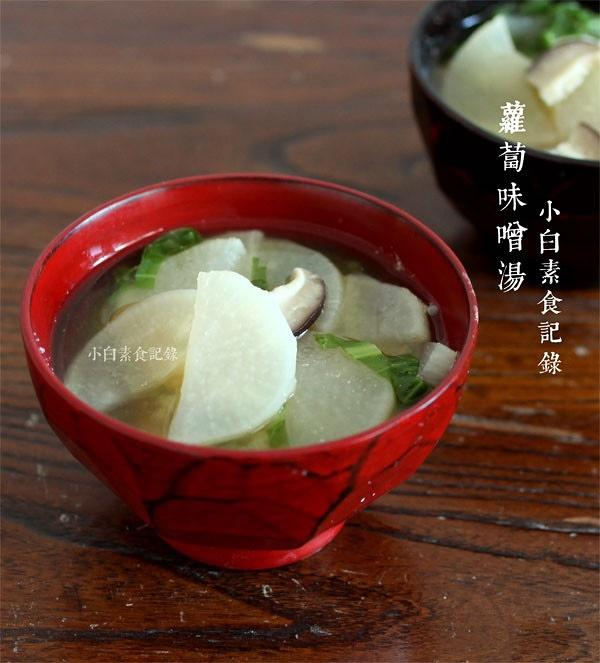

# 味噌萝卜暖身汤

## 📋 基本資訊 / Recipe Overview
- **料理名稱**：味噌萝卜暖身汤
- **原始標題**：味噌萝卜暖身汤
- **素食流派 / Diet**：全素 Vegan
- **料理分類 / Category**：养生汤品
- **來源平台 / Source**：[下廚房 · 素食主義專區](https://www.xiachufang.com/recipe/1011196/)

## 🌿 食材及佐料清單 / Ingredients
- 半根白萝卜
- 两朵香菇
- 一片芥菜
- 1大匙味噌

## 🍳 烹飪步驟 / Step-by-Step Cooking Steps
1. 白萝卜去皮，切成片。香菇洗净去蒂切丝。芥菜切细丝待用
2. 锅中烧开两碗水，下入香菇和白萝卜煮10分钟以上，让白萝卜呈半透明状，此时汤已经成了萝卜香菇高汤，萝卜的辛辣全无，只剩甘甜
3. 下入1大匙味噌煮化，放入芥菜丝搅拌均匀即可

## 💡 大廚美味秘訣 / Chef's Tips
- 特别简单的一道汤，味道也是一级棒

---
*食譜歸檔時間：2026-08-20 · 來源：下廚房 (www.xiachufang.com)*