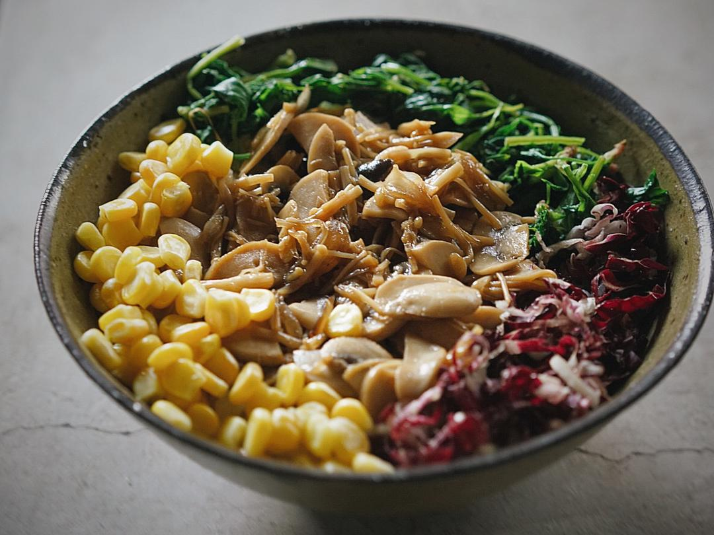

# 和风蘑菇饭 很适合做便当

## 📋 基本資訊 / Recipe Overview
- **料理名稱**：和风蘑菇饭 很适合做便当
- **原始標題**：和风蘑菇饭（很适合做便当）
- **素食流派 / Diet**：全素 Vegan
- **料理分類 / Category**：米食主食
- **來源平台 / Source**：[下廚房 · 素食主義專區](https://www.xiachufang.com/recipe/102840218/)

## 🌿 食材及佐料清單 / Ingredients
- 四五个口蘑
- 一个杏鲍菇
- 一小把金针菇
- 一个（或者普通洋葱1/4)洋葱头
- 18g（或生抽，不同品牌咸度有差异）淡味酱油
- 12g味淋
- 5g日式清酒(没有可略）
- 米饭
- 各色蔬菜

## 🍳 烹飪步驟 / Step-by-Step Cooking Steps
1. 原材料图示
实在没味淋的话，可以用4g糖替代，但是味道肯定没有味淋好哈~不建议用香菇之类味道很重的菌菇，如果用的话一定要少。
口蘑切片，杏鲍菇切半圆片，金针菇去掉底部切3cm段，洋葱切薄片。这个时候配菜们也可以准备了，比如蔬菜烫熟，生菜切丝等等
2. 锅烧热下油，油量多一些，中火吧洋葱炒出香味，加入蘑菇们同炒
3. 蘑菇炒出水并完全熟了的时候，加入酱油味淋清酒炒一两分钟就好了，不要把汁收干哦
4. 取一只大碗，盛一碗刚焖好的米饭至七八分满，盖上炒好的蘑菇们
5. 摆上准备好的其他蔬菜，我今天用的是家里有的菠菜（煮熟挤水）菊苣切丝，甜玉米粒~拌匀开吃。

## 💡 大廚美味秘訣 / Chef's Tips
- 做起来很简单很快速的蘑菇饭，经常有人问哪些适合做便当，这个就很适合
米饭做成杂粮饭，藜麦鹰嘴豆红米各种放，还可以在蘑菇快炒好的时候加入几片嫩豆腐，滑滑软软的，等中午吃的时候豆腐也完全吸足了汤汁。蘑菇炒的时候回出有点黏稠又鲜味十足的汁，再以酱油味淋调味，日式的微甜酱油口味很适合拌饭。最后摆上你喜欢的蔬菜，带饭的话建议不要用熟的绿叶菜，你也可用圆白菜丝，煮熟的西蓝花等等各种五颜六色的菜菜
热一下拌匀开吃

---
*食譜歸檔時間：2026-08-20 · 來源：下廚房 (www.xiachufang.com)*