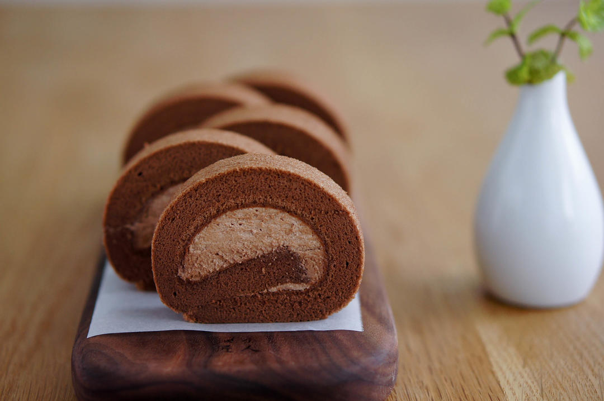

# 咸摩卡奶油卷 完美毛巾面技巧+回味无穷摩卡配方 烘焙视频蛋糕篇9「中卷」

## 📋 基本資訊 / Recipe Overview
- **料理名稱**：咸摩卡奶油卷 完美毛巾面技巧+回味无穷摩卡配方 烘焙视频蛋糕篇9「中卷」
- **原始標題**：咸摩卡奶油卷/完美毛巾面技巧+回味无穷摩卡配方/烘焙视频蛋糕篇9「中卷」
- **素食流派 / Diet**：蛋奶素 Ovo-Lacto
- **料理分類 / Category**：面食主食
- **來源平台 / Source**：[下廚房 · 素食主義專區](https://www.xiachufang.com/recipe/102394566/)

## 🌿 食材及佐料清單 / Ingredients
- #摩卡蛋糕胚（28*28cm烤盘）#
- 4个鸡蛋
- 60g低筋面粉
- 70g细砂糖
- 55g植物油
- 55g热水
- 10g可可粉
- 1包（1.8g）速溶黑咖啡粉
- #摩卡咸奶油#
- 150g淡奶油
- 15g细砂糖
- 1/4小勺（1g）盐
- 2g可可粉
- 1包（1.8g）速溶黑咖啡粉

## 🍳 烹飪步驟 / Step-by-Step Cooking Steps
1. 准备工作：
1.烤箱预热至180℃
2.烤盘垫硅胶垫
（不是油纸！不是油布！就是硅胶垫！）
3.热水冲开可可粉和咖啡粉，冷却备用
（如无时间冷却，可用25g热水调匀粉类，再加入30g冷水降温稀释）
2. 制作蛋糕胚：
打蛋盆中倒入摩卡糊
3. 植物油
4. 滴几滴香草精。
5. 筛入面粉
6. 搅拌成湿软的面团
7. 分蛋，蛋白放入无油无水的盆子里。
8. 加入蛋黄。
9. 搅拌均匀，形成细腻流畅的面糊。
10. 打发蛋白，分三次下糖。
11. 打发出大气泡时下第一次糖。
12. 当泡沫变细腻时下第二次糖。
13. 提起打蛋器，蛋白会流回盆子里时倒入剩余的糖。
14. 直到湿性发泡。（要打的比薄卷的状态硬一点）
15. 低速缓提甩掉打蛋头上的蛋白霜。
16. 关于打发档速：
最高速（5档）打发至下最后一次糖。
转中速（3档）打发至接近湿性发泡。
转低速（1档）打发至完成。
原因：
高速打发加快效率，
中速把握避免打发过度，
低速消除大气泡使蛋白霜稳定细腻。

个人建议，仅供参考。

如果蛋白霜一直打不起来，有两种可能：
1.蛋白中混入杂质（油水蛋黄）
2.打蛋器功率太低，请用最高速尝试一下。）
17. 挖一勺蛋白霜和蛋黄糊捞拌均匀。
18. 倒回蛋白霜中。
19. 捞拌均匀。
20. 捞拌时可抬高蛋抽，利用滑落重力拌匀面糊。
21. 用刮刀紧贴底部整理面糊。
22. 倒入铺好硅胶垫的烤盘。（毛巾面关键）
（硅胶垫是迄今为止做出毛巾面的最稳定方法，油纸/油布/啥都不铺也能做出成功的蛋糕，但是失败几率会比较大）
23. 向四角倾斜。
24. 震出大气泡。
25. 180℃，中层，烘焙20分钟。
26. 出炉后震出热气，马上脱模。
27. 刮刀紧贴四壁一滑到底。
28. 盖上油纸。
29. 倒盖晾网。
30. 翻转倒扣（小心烫）
31. 轻轻抖动，趁热脱模。
32. 趁热掀起硅胶垫一角，轻轻撕开。（毛巾面关键）
33. 就能得到完美的毛巾面啦~
34. 盖回去，防止水分流失。
35. 等待蛋糕冷却时我们来做摩卡咸奶油。
36. 所有原料加入淡奶油中。
（淡奶油隔冰水打发会更稳定。）
37. 低速打发避免粉末四溅。
38. 直到非常结实。
蛋糕卷奶油（在不打过头的前提下）打硬一点，越硬越好，后面卷制会轻松一些。
39. 拿掉硅胶垫。
放上硅油纸，前后各长15-20cm
盖上硅胶垫。
翻转。
40. 斜切掉前后边缘。
41. 抹上奶油。
42. 侧视图。
43. 俯视图。
如图所示，涂抹成一个中间凸起的小山丘。
44. 接下来卷蛋糕，
擀面棍提起油纸卷起蛋糕，轻压定型。
45. 利用前上方的擀面棍把油纸往后退，通过油纸卷起蛋糕。
注意：擀面棍是在蛋糕卷的前上方而非上方，否则蛋糕会被推出去。
46. 要不断往后退油纸，擀面棍要一直处于紧贴着被抽紧油纸包裹住的蛋糕前上方，就这么一点点的往前卷，直到擀面棍碰到垫子。
47. 左手往前拉，右手往后推，用力抽紧蛋糕。
48. 换个角度看一下。
49. 我卷
50. 我卷卷卷卷卷~
51. 最后双手捋平蛋糕。
52. 顺势向前滚，包好蛋糕。
53. 冷藏定型后切块，蛋糕卷就做好啦~

## 💡 大廚美味秘訣 / Chef's Tips
- 毛巾面关键：
垫底硅胶垫，脱模趁热快；
轻提一角撕，复盖保水分。

---
*食譜歸檔時間：2026-08-20 · 來源：下廚房 (www.xiachufang.com)*