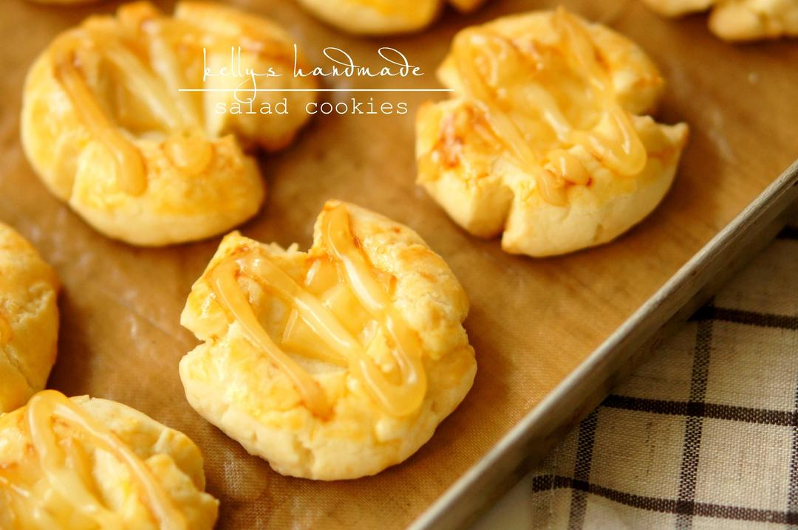

# 咸酥芝士曲奇

## 📋 基本資訊 / Recipe Overview
- **料理名稱**：咸酥芝士曲奇
- **原始標題**：咸酥芝士曲奇
- **素食流派 / Diet**：蛋奶素 Ovo-Lacto
- **料理分類 / Category**：面食主食
- **來源平台 / Source**：[下廚房 · 素食主義專區](https://www.xiachufang.com/recipe/100387597/)

## 🌿 食材及佐料清單 / Ingredients
- 125g总统黄油
- 235g低粉
- 60g糖粉
- 1/2小勺（2.5g）盐
- 1个蛋黄
- 120g切达芝士
- #表面材料#
- 另备一个蛋黄抹面
- 适量沙拉酱装入挤花袋中
- 一片芝士切成小正方块备用。
- 可备少许葱末待用。

## 🍳 烹飪步驟 / Step-by-Step Cooking Steps
1. 1.黄油+糖粉软化后打发。
2. 2.加入蛋黄搅打至发白。
3. 3.筛入低粉 加入盐和芝士碎丁 切拌均匀
4. 4.此时的面团应该是成团但不黏手的 也不会附着在盆子内壁。
5. 5.抓一块放在秤上 保持每一块都在25g左右 团圆 像玛格丽特一样用拇指摁下去。
6. 6.抹上蛋黄液 放上切成小方块的芝士片 挤上沙拉酱。
7. 7.根据个人口味决定是否放上葱末 
 180度 中层 15min。

有盆友说烤完中间发软，这是因为家用烤箱较小，饼干中的水蒸气没有完全蒸发导致的，可以尝试一下150℃25分钟烤干水分，转180℃烘焙10分钟左右直至表面金黄即可。

## 💡 大廚美味秘訣 / Chef's Tips
- 这个口感是比较酥松的 虽然长得有点像桃酥 但是一抿即化 味道层次很丰富。

---
*食譜歸檔時間：2026-08-20 · 來源：下廚房 (www.xiachufang.com)*