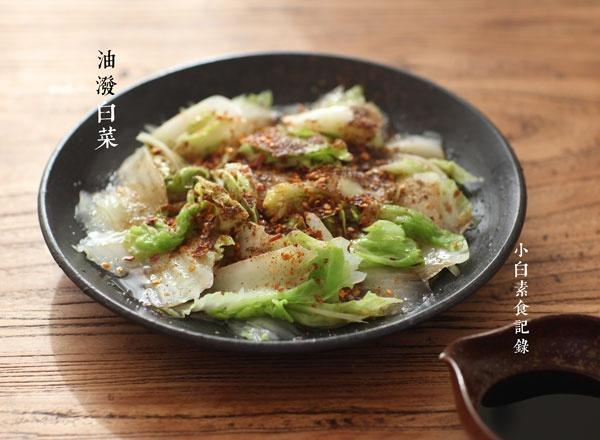

# 响油白菜

## 📋 基本資訊 / Recipe Overview
- **料理名稱**：响油白菜
- **原始標題**：响油白菜
- **素食流派 / Diet**：全素 Vegan
- **料理分類 / Category**：面食主食
- **來源平台 / Source**：[下廚房 · 素食主義專區](https://www.xiachufang.com/recipe/1044103/)

## 🌿 食材及佐料清單 / Ingredients
- 300g白菜
- 2小匙生抽
- 1小匙陈醋
- 1/2小匙盐
- 1/4小匙糖
- 一点点花椒粉
- 根据个人洗好添加辣椒粉
- 1大匙油
- 可有可无白芝麻

## 🍳 烹飪步驟 / Step-by-Step Cooking Steps
1. 白菜洗净，用手撕成条，放入烧开了水的锅中，待水再次开起就捞出，不要煮时间长了，这样刚好爽口
2. 烫过的白菜控掉水，放入盘中，依次浇上生抽，盐糖，花椒粉辣椒粉
3. 1大匙油放入小锅中烧热热的，均匀浇在撒了调料的白菜上，与此同时倒入一勺好醋（今天用的宁化府老陈醋）~拌一下就可以吃啦

## 💡 大廚美味秘訣 / Chef's Tips
- 油不需太多，够浇熟调料即可 
放凉了也很好吃

---
*食譜歸檔時間：2026-08-20 · 來源：下廚房 (www.xiachufang.com)*