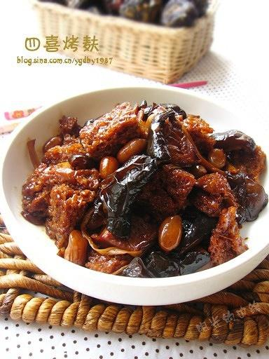

# 四喜烤麸

## 📋 基本資訊 / Recipe Overview
- **料理名稱**：四喜烤麸
- **原始標題**：四喜烤麸
- **素食流派 / Diet**：全素 Vegan
- **料理分類 / Category**：家常蔬食 / 经典热菜
- **來源平台 / Source**：[下廚房 · 素食主義專區](https://www.xiachufang.com/recipe/95233/)

## 🌿 食材及佐料清單 / Ingredients
- 100g烤麸
- 40g木耳
- 20g黄花菜
- 30g花生
- 4朵香菇
- 15ml老抽
- 10ml生抽
- 3小勺（约10g）糖
- 160ml（香菇水）水
- 芝麻油

## 🍳 烹飪步驟 / Step-by-Step Cooking Steps
1. 所有材料泡发后挤干水分备用(标注重量为泡发后)
2. 烤麸撕成小块，香菇一切四，黄花菜一切二，木耳撕小朵
3. 锅中烧水，花生煮10分钟捞出备用，烤麸煮3分钟捞出挤水备用
4. 锅中倒油，稍微多一些，放入烤麸煸炒至表面微黄
5. 锅中再倒一点油，放入木耳，香菇和黄花菜煸炒
6. 倒入所有调料中火煮至入味，最后大火收汁，出锅前淋芝麻油

## 💡 大廚美味秘訣 / Chef's Tips
- 四喜烤麸是非常经典的上海家常菜，也是我非常喜爱的南方菜。 
甚至在没吃过之前，我就知道我一定会喜欢。 
诱人的颜色，醇厚的滋味，典型的上海咸甜味。 
所有材料充分吸收了汤汁的味道，美妙滋味不可言喻。 
这道菜所用的材料全部是干货，平时家里备上点， 
什么时候想吃了随时可以做，非常方便。

---
*食譜歸檔時間：2026-08-20 · 來源：下廚房 (www.xiachufang.com)*