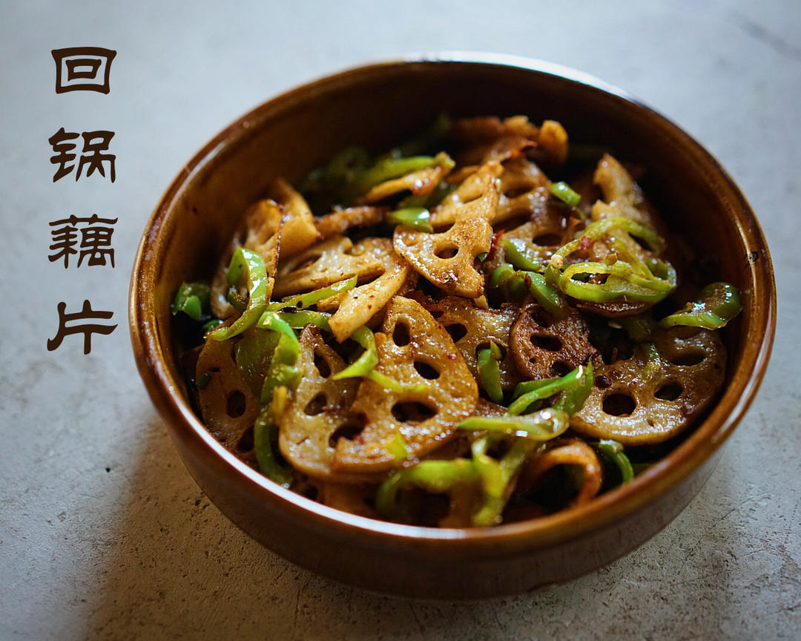

# 回锅藕片

## 📋 基本資訊 / Recipe Overview
- **料理名稱**：回锅藕片
- **原始標題**：回锅藕片
- **素食流派 / Diet**：全素 Vegan
- **料理分類 / Category**：家常蔬食 / 经典热菜
- **來源平台 / Source**：[下廚房 · 素食主義專區](https://www.xiachufang.com/recipe/102847852/)

## 🌿 食材及佐料清單 / Ingredients
- 节藕
- 两个尖椒
- 1-2瓣蒜
- 1大匙（15ml)郫县豆瓣酱
- 1小匙(5ml)黑豆豉

## 🍳 烹飪步驟 / Step-by-Step Cooking Steps
1. 原料准备，莲藕一大截，脆藕为佳。黑豆豉就是图片这种黑色干豆豉，豆瓣酱我选择了免剁的，每次剁起来案板好不利索偷个懒~如果你喜欢更辣一些可以加新鲜的红朝天椒
2. 莲藕去皮切2-3毫米厚的半圆片，尖椒斜切丝，蒜剁碎。
3. 锅烧热下油，将切好的藕片码入锅中，中火煎至一面微金黄，再煎另一面，煎的火候不够或太干焦都会影响口感。一大截莲藕大概要分3次煎完，每次适当往锅中补充些油。煎好的莲藕待用
4. 利用锅内余油，小火将蒜、豆豉、豆瓣酱炒香，如果没余油了适当补充哈，这里一定要用小火，因为豆瓣酱很容易炒焦。
5. 加入青椒一起炒至断生，再加入煎好的莲藕同炒两分钟至入味即可，因为豆豉和豆瓣酱的风味咸味都很足，无需其他调味啊。

## 💡 大廚美味秘訣 / Chef's Tips
- 这是一道超简单的下饭菜，回锅顾名思义，将主要食材要进行一次煎制后再次回锅跟别的配菜们一起炒制，调料湖南用黑豆豉多一些，四川用郫县豆瓣酱多一些，一千个家庭有一千种不用的做法，我喜欢这两种一起用，只要注意下比例，味道层次更加丰富
还可以做回锅豆腐、回锅土豆、回锅杏鲍菇各种。。。～家中常备豆瓣酱，随时来一盘餐桌上最受欢迎的小炒

---
*食譜歸檔時間：2026-08-20 · 來源：下廚房 (www.xiachufang.com)*