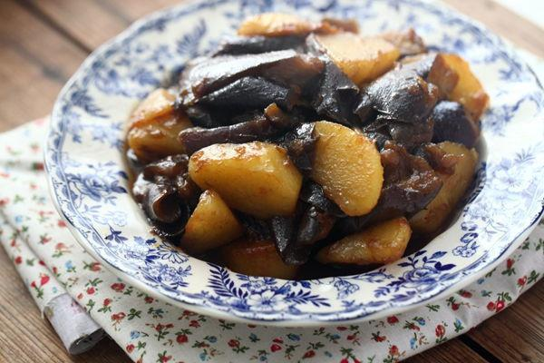

# 土豆烧茄子

## 📋 基本資訊 / Recipe Overview
- **料理名稱**：土豆烧茄子
- **原始標題**：土豆烧茄子
- **素食流派 / Diet**：全素 Vegan
- **料理分類 / Category**：家常蔬食 / 经典热菜
- **來源平台 / Source**：[下廚房 · 素食主義專區](https://www.xiachufang.com/recipe/100100146/)

## 🌿 食材及佐料清單 / Ingredients
- 土豆
- 茄子

## 🍳 烹飪步驟 / Step-by-Step Cooking Steps
1. 茄子切滚刀块，用微波炉转10分钟左右，78分熟
2. 土豆去皮切滚刀块，稍微小一点不要太大，泡水去掉多余的淀粉 
起油锅，油稍微多一点点，下土豆块，用中小火煎，煎到起脆壳边缘有点焦黄，大概9分熟样子
3. 下茄子，过油煸炒1,2分钟 
加生抽，糖调味即可出锅

## 💡 大廚美味秘訣 / Chef's Tips
- 突破常规 
没有用平时习惯的烧的方法 
而改用油煎 
口感灰常好 
粉粉的土豆 带一点点脆壳 好吃好吃

---
*食譜歸檔時間：2026-08-20 · 來源：下廚房 (www.xiachufang.com)*