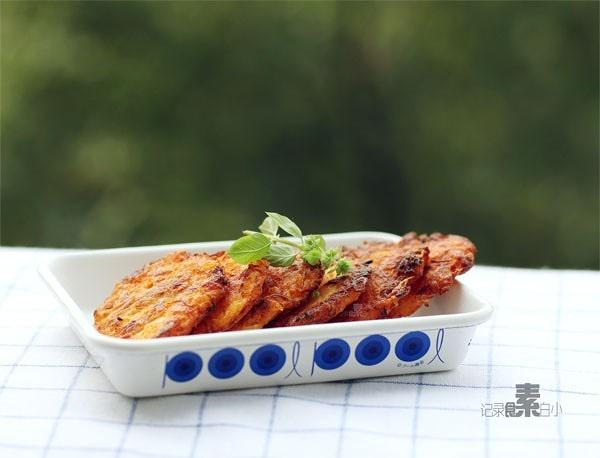

# 土豆胡萝卜丝煎饼

## 📋 基本資訊 / Recipe Overview
- **料理名稱**：土豆胡萝卜丝煎饼
- **原始標題**：土豆胡萝卜丝煎饼
- **素食流派 / Diet**：全素 Vegan
- **料理分類 / Category**：面食主食
- **來源平台 / Source**：[下廚房 · 素食主義專區](https://www.xiachufang.com/recipe/1003965/)

## 🌿 食材及佐料清單 / Ingredients
- 1个土豆
- 土豆的1/3分量胡萝卜
- 2大匙（30ml)面粉
- 1/2小匙盐
- 少许白胡椒粉

## 🍳 烹飪步驟 / Step-by-Step Cooking Steps
1. 土豆胡萝卜去皮擦成细丝
2. 用手挤掉多余水分，加入2大匙面粉，1/2小匙盐和少许白胡椒粉拌匀
3. 用手拍成圆饼，放入加了少许油的平底锅中小火煎至两面金黄即可
4. 这个真的很简单，好像也木有什么注意事项了，我喜欢土豆煎的焦焦的香味~

## 💡 大廚美味秘訣 / Chef's Tips
- 非常简单快手，而且很受欢迎的土豆丝饼~~~~

---
*食譜歸檔時間：2026-08-20 · 來源：下廚房 (www.xiachufang.com)*