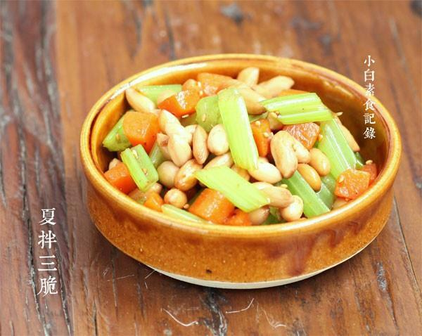

# 夏拌三脆

## 📋 基本資訊 / Recipe Overview
- **料理名稱**：夏拌三脆
- **原始標題**：夏拌三脆
- **素食流派 / Diet**：全素 Vegan
- **料理分類 / Category**：面食主食
- **來源平台 / Source**：[下廚房 · 素食主義專區](https://www.xiachufang.com/recipe/1042768/)

## 🌿 食材及佐料清單 / Ingredients
- 100g生的带皮花生
- 两棵芹菜
- 一根胡萝卜
- 1/2小匙盐
- 1/4小匙糖
- 2小匙生抽
- 2小匙陈醋
- 一点点香油
- 一点点白胡椒粉

## 🍳 烹飪步驟 / Step-by-Step Cooking Steps
1. 芹菜洗净去掉叶子待用，干的带皮生花生提前泡发，胡萝卜洗净。芹菜切成斜段，胡萝卜切丁
2. 锅里烧开一锅水，加点盐，胡萝卜丁煮3分钟捞出过冷水，芹菜放锅里煮到水再次开起即可捞出，过冷水，花生煮四五分钟捞出过冷水
3. 过完冷水的胡萝卜芹菜花生控掉水分，加上盐糖，生抽陈醋，香油白胡椒粉拌匀即可，当然如果喜欢可加1小匙辣椒油同拌

## 💡 大廚美味秘訣 / Chef's Tips
- 从小吃的菜，每到夏天家里餐桌上就会添上这道小菜，再拍个黄瓜，蒸些茄子玉米土豆，炒上些炸酱沾着吃，再煮一锅绿豆汤。。。真是简单清爽的夏天家常菜，吃完了肠胃也是舒服的 
有时，这道小菜里还会加上点腐竹一起拌

---
*食譜歸檔時間：2026-08-20 · 來源：下廚房 (www.xiachufang.com)*