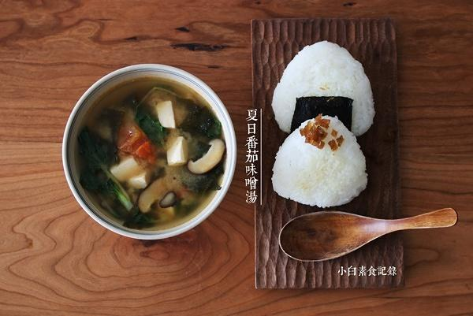

# 夏日番茄味噌汤

## 📋 基本資訊 / Recipe Overview
- **料理名稱**：夏日番茄味噌汤
- **原始標題**：夏日番茄味噌汤
- **素食流派 / Diet**：全素 Vegan
- **料理分類 / Category**：养生汤品
- **來源平台 / Source**：[下廚房 · 素食主義專區](https://www.xiachufang.com/recipe/100533477/)

## 🌿 食材及佐料清單 / Ingredients
- 1个（大号）番茄
- 半盒内酯豆腐
- 1大匙螺旋藻（干）
- 三四朵香菇（或其它菌菇）
- 一把绿叶菜（我用的小白菜苗）
- 2大匙味噌
- 2碗水

## 🍳 烹飪步驟 / Step-by-Step Cooking Steps
1. 准备原材料，番茄茄小块，豆腐切块，干的螺旋藻用清水泡10分钟，香菇切薄片，青菜洗干净，切或择成易入口的小块。
2. 锅烧热放少许油，放入切好的番茄块中火翻炒至化掉（一定要炒到至少这种状态！汤里有大块熟番茄蛮糟糕的我觉得），然后加入香菇片略炒，倒入两碗水烧开。水开后依次加入螺旋藻、内酯豆腐烧开。然后倒入稀释好的味噌（稀释方法请看下一条步骤）加入洗好的青菜搅拌，关火。
3. 舀半碗锅中的热汤到装味噌酱的小碗中，搅拌一会儿，化开。味噌建议用白味噌，夏天的汤还有番茄适合清淡一点的味道。
4. 螺旋藻泡之前，泡10分钟之后。口感嫩滑很适合做汤又营养，网上很容易买到推荐给大家。
5. “老板！来一份番茄味噌汤饭团子套餐！”蒸一锅米饭，趁热拌寿司醋（自制寿司醋 将米醋：盐：糖5：1：2小火加热至糖完全融化放凉即可）捏成饭团子~裹上海苔或者喜欢的东东。
6. 这个是用圆白菜、口蘑做的版本，如果你喜欢辣，可以在炒完番茄后加一小勺辣椒酱（不要油油的那种，要以鲜辣椒为主的那种）里面的圆白菜切成易入口的小块，大家可以根据自己喜好做各种版本~

## 💡 大廚美味秘訣 / Chef's Tips
- 夏天做味噌汤，我喜欢先把番茄炒化打底，加入当季时蔬，再捏两个饭团子，简单一餐就有了。给几个朋友做过，大家都很喜欢，而且做法简单，妈妈也把这个当成家中常做的菜啦。以下是两人份汤（每增加一人份，增加一个小号番茄，适量时蔬，一碗水，1大匙味噌）

---
*食譜歸檔時間：2026-08-20 · 來源：下廚房 (www.xiachufang.com)*