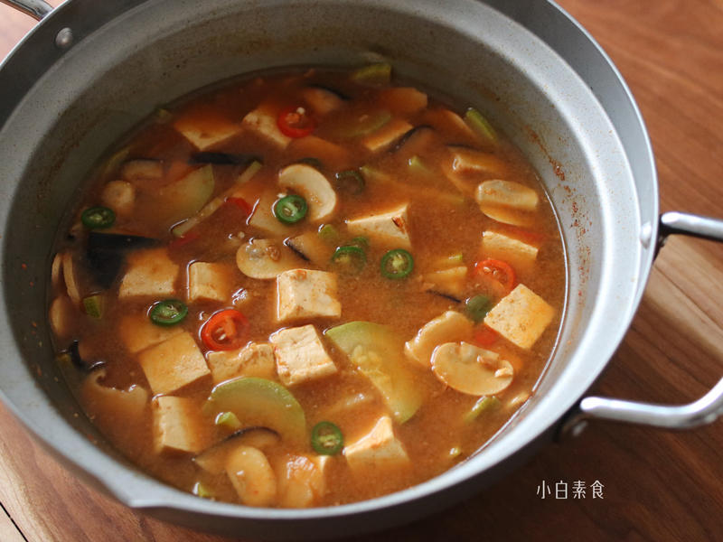

# 大酱汤

## 📋 基本資訊 / Recipe Overview
- **料理名稱**：大酱汤
- **原始標題**：大酱汤
- **素食流派 / Diet**：全素 Vegan
- **料理分類 / Category**：养生汤品
- **來源平台 / Source**：[下廚房 · 素食主義專區](https://www.xiachufang.com/recipe/102803339/)

## 🌿 食材及佐料清單 / Ingredients
- 半根或一个小的西葫芦
- 1个土豆
- 三四个口蘑
- 二三个香菇
- 一块豆腐
- 各少许配色青红椒
- 2大勺韩式大酱
- 1小勺韩式辣酱
- 三碗淘米水

## 🍳 烹飪步驟 / Step-by-Step Cooking Steps
1. 原料准备：淘米水用二遍和三遍，一遍时轻柔洗掉浮灰，二遍稍微用力搓一下，因为淘米水的主要成分就是淀粉，我们利用淀粉来给大酱汤起到增稠作用。豆腐我选择老豆腐，耐炖可以久煮入味，当然你也可以选择嫩的晚一点放。青红椒在这里起到配色作用，辣酱的加入是让汤有一点辣辣的感觉，这里也可以加细辣酱粉替代，如果不吃辣，可略。
2. 土豆去皮切3mm厚片，西葫芦蘑菇也切这么厚片，辣椒切薄圈，豆腐切2.5cm方块待用
3. 锅烧热加少许油，把蘑菇炒香，倒入淘米水，加入土豆一起煮开，再加入其它切好的蔬菜豆腐煮至断生
4. 把韩式大酱和辣酱加入搅开继续盖上锅盖小火煮10分钟以上，让蔬菜软烂入味即可。每个品牌大酱有差异，建议放大酱的时候尝一下咸淡。
5. 米饭也焖好了，开吃！

## 💡 大廚美味秘訣 / Chef's Tips
- 天气一冷就想喝的汤，做起来也省事儿，即是汤也是菜，还能把二三遍的淘米水重复利用。
大酱汤和味噌汤都是用发酵的“酱”来制作的，酱的原料也很接近，黄豆、小麦、盐等等不同的是工艺菌种等差异，最后风味也差异很大，不过话说回来，千百种味噌和千百种韩式大酱中应该有风味很类似的吧。
以下是两人份

---
*食譜歸檔時間：2026-08-20 · 來源：下廚房 (www.xiachufang.com)*