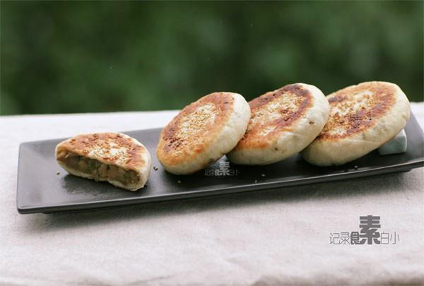

# 尖椒茄子馅饼

## 📋 基本資訊 / Recipe Overview
- **料理名稱**：尖椒茄子馅饼
- **原始標題**：尖椒茄子馅饼
- **素食流派 / Diet**：全素 Vegan
- **料理分類 / Category**：面食主食
- **來源平台 / Source**：[下廚房 · 素食主義專區](https://www.xiachufang.com/recipe/1003167/)

## 🌿 食材及佐料清單 / Ingredients
- 一根茄子
- 一个尖椒
- 250g自发粉
- 1小匙姜末
- 1/2小匙盐
- 1/2小匙糖
- 1大匙生抽
- 2大匙油
- 140ml温水

## 🍳 烹飪步驟 / Step-by-Step Cooking Steps
1. 茄子切小丁，尖椒切碎，姜切末
2. 茄子丁、尖椒、姜末与生抽、盐、糖和两大匙油拌匀
3. 下入锅中小火炒至茄子变软即可
4. 温水和自发粉和匀揉成光滑的面团，盖上保鲜膜或湿布醒半个小时左右）
5. 面团擀成条，切成六等分
6. 取一份擀成圆饼，将两大匙馅料放在中间，包裹住，封口，再用手轻压成饼，封的不是太严也没关系，煎熟后就好了~
7. 包好的饼表面涂少许清水，然后沾上熟芝麻~
8. 锅烧热下一点油，把饼放入小火煎2分钟再翻面煎2分钟即可，因为馅料是熟的，所以只需要把面皮煎熟就行了

## 💡 大廚美味秘訣 / Chef's Tips
- 如用普通面粉，需要先用温水融化酵母，加入糖拌匀，再用来和面 (普通面粉250g 温水140ml 酵母3g 白糖1小匙） 
烙好的馅饼太香了，茄子本身会吸汁，所以一口咬下去非常的多汁~~~~ 
力荐！

---
*食譜歸檔時間：2026-08-20 · 來源：下廚房 (www.xiachufang.com)*