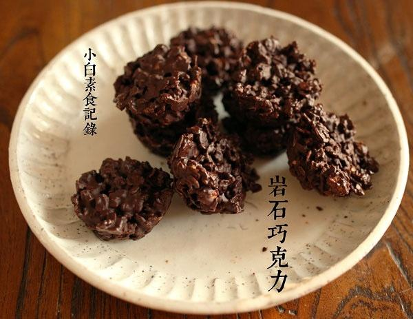

# 岩石巧克力

## 📋 基本資訊 / Recipe Overview
- **料理名稱**：岩石巧克力
- **原始標題**：岩石巧克力
- **素食流派 / Diet**：全素 Vegan
- **料理分類 / Category**：家常蔬食 / 经典热菜
- **來源平台 / Source**：[下廚房 · 素食主義專區](https://www.xiachufang.com/recipe/1070518/)

## 🌿 食材及佐料清單 / Ingredients
- 80g即食麦片
- 80g黑巧克力

## 🍳 烹飪步驟 / Step-by-Step Cooking Steps
1. 首先把黑巧克力掰成小块待用
2. 即食麦片我用的是家里现成的，肉桂味的，为了让它更脆，用平底锅小火干烤一下，晾凉待用
3. 挑一个模具，我用的是迷你马芬模，在内部均匀涂上薄薄的植物油，以便后面更轻易的脱模
4. 隔水加热巧克力
5. 大锅加适量水，黑巧克力放入小锅或小容器中，把小容器放入大锅中，开火加热不时搅拌下，至巧克力全部融化即可关火，拿出小锅放在一旁让巧克力温度降至摸起来温温即可
6. 注意，巧克力不能过度加热，否则会有分离显现，融化就马上停止加热
7. 让巧克力降温这样能保证麦片口感脆脆的
8. 将降温的巧克力与麦片搅拌均匀
9. 装入模具中，压实压平（也可以挑个普通的盘子来做模具，凉透后再切块，注意一定要厚一点，有个三四厘米厚才过瘾！）
10. 移入冰箱冷藏半小时，或者，干脆冷冻一会
11. 取出，轻敲容器底，脱模即可~

## 💡 大廚美味秘訣 / Chef's Tips
- 用不同口味的巧克力，比如白巧克力，抹茶巧克力也有非常好的效果~ 
如果愿意琢磨，加点黑咖啡粉进去来个咖啡味的也不错~ 
建议不要用太甜的巧克力~ 
还有，最好用即食麦片，那种需要煮了才能吃的我没试过 
估计先烤香了也可以用

---
*食譜歸檔時間：2026-08-20 · 來源：下廚房 (www.xiachufang.com)*