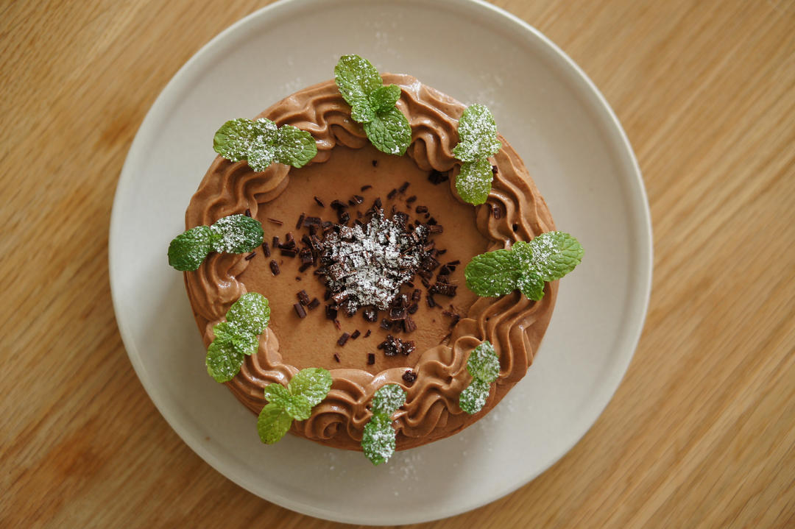

# 巧克力奶油蛋糕 巧克力奶油的操作手法。 「戚风及其衍生」烘焙视频蛋糕篇2

## 📋 基本資訊 / Recipe Overview
- **料理名稱**：巧克力奶油蛋糕 巧克力奶油的操作手法。 「戚风及其衍生」烘焙视频蛋糕篇2
- **原始標題**：巧克力奶油蛋糕/巧克力奶油的操作手法。/「戚风及其衍生」烘焙视频蛋糕篇2
- **素食流派 / Diet**：蛋奶素 Ovo-Lacto
- **料理分類 / Category**：面点小吃
- **來源平台 / Source**：[下廚房 · 素食主義專區](https://www.xiachufang.com/recipe/102263254/)

## 🌿 食材及佐料清單 / Ingredients
- 50克黑巧克力
- 250克鲜奶油
- 15克细砂糖
- 一个（制法见前）六寸巧克力蛋糕胚

## 🍳 烹飪步驟 / Step-by-Step Cooking Steps
1. 把巧克力掰碎。
依旧是碎碎念，巧克力不多换个盆子少一口，请放在方便打发的盆子里不用待会再换碗。
2. 淡奶油和细砂糖混合煮至边缘冒气泡。
注意搅拌避免糊底。
不要煮过头。
3. 分三次倒入巧克力中。
4. 从中心向边缘以画同心圆方式搅拌，慢慢将边缘的淡奶油带进巧克力里进行乳化操作。
5. 因为配方中巧克力分量并不多，可以不隔水融化，而是通过掰碎（为什么不是切碎因为你待会还得去洗砧板和刀）加大接触面积。
搅拌方法请尽可能循步进行，不要一开锅就把巧克力一股脑全倒进去，心急吃不了热豆腐哦。
6. 搅拌均匀后是富有光泽的甘纳许状态，滑落的痕迹不会消失。
7. 倒入第二次淡奶油。
8. 继续搅拌。
可以使用刮刀，汤勺或者打蛋器。
如果使用打蛋器，请不要啪啪啪把空气打进去，温柔地拌匀就好了。
9. 把剩下的淡奶油全部倒进去，搅拌均匀。
10. 拌匀后室温晾凉，然后包好放冰箱冷藏一夜备用。
11. 冷藏一夜之后，低速打发淡奶油。
12. 直到奶油变硬。
（注意：不要偷吃！我就是因为偷吃差点连最后的挤花都没完成😂）
13. 蛋糕片（做法见此http://www.xiachufang.com/recipe/102257709/）上挖一勺奶油抹开。
14. 放上第二层蛋糕片。
15. 继续挖一大坨奶油抹开。
16. 边缘抹上奶油。（之前的草莓奶油蛋糕有详细的抹面手法不赘述。唯一不同是奶油的硬度，巧克力奶油比较硬可以直接挖一大勺像糊墙一样糊边上。）
17. 四周溢出的奶油向中间抹平。
18. 最后轻贴边缘转一圈抹平。
19. 两只抹刀转移蛋糕。
20. 剩余奶油（如果有的话···）挤花装饰。

## 💡 大廚美味秘訣 / Chef's Tips
- 请大家尽情发挥，我是直接跑去掐了几片薄荷叶就功成身退了.
关于巧克力蛋糕胚，请看http://www.xiachufang.com/recipe/102257709/。
关于如何抹面，请看http://www.xiachufang.com/recipe/102245146/。
至于有没有定力在打完奶油后做出蛋糕，请看你自己:)

---
*食譜歸檔時間：2026-08-20 · 來源：下廚房 (www.xiachufang.com)*