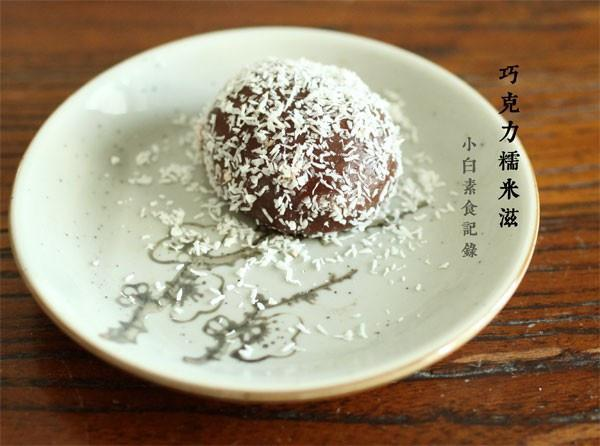

# 巧克力糯米滋

## 📋 基本資訊 / Recipe Overview
- **料理名稱**：巧克力糯米滋
- **原始標題**：巧克力糯米滋
- **素食流派 / Diet**：全素 Vegan
- **料理分類 / Category**：面食主食
- **來源平台 / Source**：[下廚房 · 素食主義專區](https://www.xiachufang.com/recipe/1012738/)

## 🌿 食材及佐料清單 / Ingredients
- 100g糯米粉
- 6小块巧克力
- 20g糖
- 1大匙可可粉
- 80g冷水
- 适量椰蓉

## 🍳 烹飪步驟 / Step-by-Step Cooking Steps
1. 将糯米粉、糖、可可粉、水混合均匀
2. 揉成光滑的面团，分成6等分
3. 取一份揉成球，压成饼，放入一块巧克力，包裹住，整形揉成球（如果巧克力的形状太方，不好包，可以将一小块巧克力掰成小块后再包）
4. 其他的面团也重复上一步骤。放在撒了一层淀粉的平盘中（为了防粘淀粉可稍微多撒些），待蒸锅里的水烧开后，将平盘放入蒸锅中，蒸15分钟
5. 15分钟后取出，稍晾凉不是特别烫手的程度，小心取出糯米滋，稍微整下形，滚上椰蓉即可。没有椰蓉用可可粉也不错
6. 趁热吃是熔心滴~
7. 小白用做夹心的巧克力比较甜，所以口味刚刚好，如果用的巧克力甜度不高，可以将面团里的糖量适量增加

## 💡 大廚美味秘訣 / Chef's Tips
- 一直想做糯米滋，以前试过用蒸熟的红薯揉糯米团，味道实在不怎么样，今天试了巧克力味的，甜度刚刚好，巧克力味香浓，口感软糯又有弹性~非常赞。没有添加通常糯米滋中使用的澄面，但是口感也很好（以下是6个糯米滋的分量）

---
*食譜歸檔時間：2026-08-20 · 來源：下廚房 (www.xiachufang.com)*