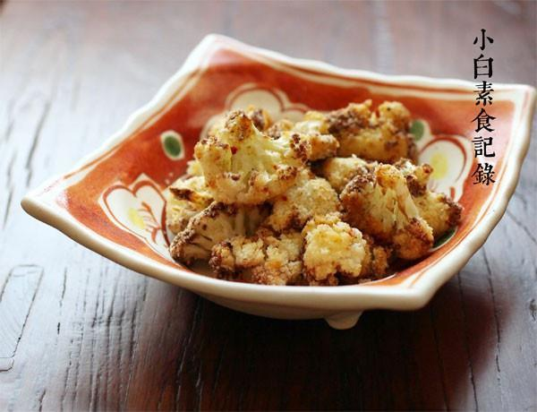

# 干烤菜花

## 📋 基本資訊 / Recipe Overview
- **料理名稱**：干烤菜花
- **原始標題**：干烤菜花
- **素食流派 / Diet**：全素 Vegan
- **料理分類 / Category**：面食主食
- **來源平台 / Source**：[下廚房 · 素食主義專區](https://www.xiachufang.com/recipe/1011524/)

## 🌿 食材及佐料清單 / Ingredients
- 一颗菜花
- 2小匙油
- 1/2小匙盐
- 1/4小匙花椒粉
- 1/2小匙辣椒粉

## 🍳 烹飪步驟 / Step-by-Step Cooking Steps
1. 菜花用手掰成小块
2. 菜花与油、盐、花椒粉、辣椒粉拌匀
3. 烤箱200度预热5分钟，放入菜花，200度中层上下火烤15分钟即可

## 💡 大廚美味秘訣 / Chef's Tips
- 怕辣的可以忽略掉辣椒粉~十字花科的菜花和圆白菜烤到微焦都特别特别的香~~

---
*食譜歸檔時間：2026-08-20 · 來源：下廚房 (www.xiachufang.com)*