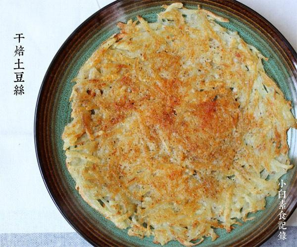

# 干焙土豆丝

## 📋 基本資訊 / Recipe Overview
- **料理名稱**：干焙土豆丝
- **原始標題**：干焙土豆丝
- **素食流派 / Diet**：全素 Vegan
- **料理分類 / Category**：面食主食
- **來源平台 / Source**：[下廚房 · 素食主義專區](https://www.xiachufang.com/recipe/1041357/)

## 🌿 食材及佐料清單 / Ingredients
- 2个中等大小或1个大土豆土豆
- 1/2小匙盐
- 1/4小匙辣椒粉
- 一点点花椒粉
- 一点点孜然粉

## 🍳 烹飪步驟 / Step-by-Step Cooking Steps
1. 土豆去皮，用擦丝器擦成丝，然后用手挤掉水分待用（注意，一定不能擦太细的丝，没口感了不好吃）
2. 平底锅锅烧热多下点油，把挤掉水的土豆丝放入锅中压平，中小火加热，有不均匀的地方就使劲压实一下防止散掉，待定型后，摇晃锅底防粘。继续加热，用筷子夹起看到底部金黄时翻面，煎另一面，另一面也金黄时，就撒上盐、辣椒粉孜然粉花椒粉即可

## 💡 大廚美味秘訣 / Chef's Tips
- 口味可根据个人喜好调整，煎的时候油要比平时炒菜多些这样会好吃。 煎好了建议用厨房纸吸下多余的油，这样就负担低啦 
另外，土豆丝堆的越厚煎的时间越长，根据情况灵活掌握 
不需要加面粉或其他东西土豆丝就可以粘在一起，在加热过程中，土豆本身的淀粉就将它们粘在一起了 
还有，土豆丝不要擦的太丝了啊，吃起来没口感，当然也别对自己的刀工太有信心，切的丝不适合做这道菜，擦的丝最好

---
*食譜歸檔時間：2026-08-20 · 來源：下廚房 (www.xiachufang.com)*