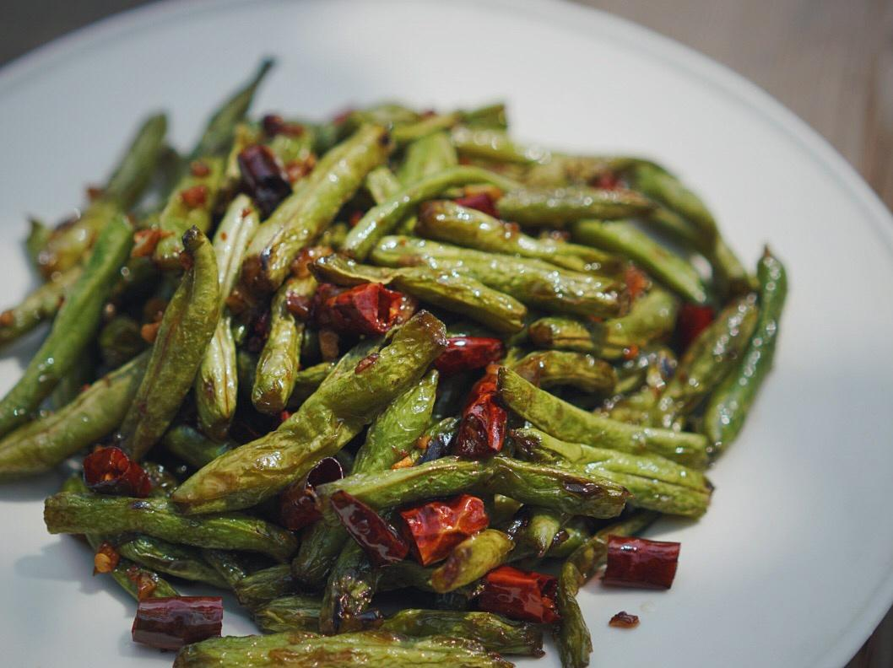

# 干煸四季豆

## 📋 基本資訊 / Recipe Overview
- **料理名稱**：干煸四季豆
- **原始標題**：干煸四季豆
- **素食流派 / Diet**：全素 Vegan
- **料理分類 / Category**：家常蔬食 / 经典热菜
- **來源平台 / Source**：[下廚房 · 素食主義專區](https://www.xiachufang.com/recipe/102417426/)

## 🌿 食材及佐料清單 / Ingredients
- 400克四季豆
- 十几个干辣椒
- 十几粒花椒
- 4瓣蒜
- 1克糖
- 2克盐
- 8克生抽
- 很多耐心

## 🍳 烹飪步驟 / Step-by-Step Cooking Steps
1. 首先搞清楚什么是四季豆，不是豇豆也不是扁豆
2. 摘掉两端，顺势撕掉筋。洗净，掰成5厘米左右长段。
3. 取一只锅，厚底最佳，锅中什么都不放，中火加热，把四季豆放入干炒，这一步骤目的是让四季豆表面残留水分蒸发，让四季豆熟的更快。很快有一些豆角已经变绿了，如图。
4. 继续翻炒，差不多都变绿了，这一步花了大概6分钟。这个时候转小火，往锅中倒油，稍微多一点，平时炒菜两倍的量，快速翻炒，如果火大了四季豆这个时候会容易糊。小火不断煸炒，四季豆表面皱了熟透了就可以了，如果做饭讲究点，又有耐心，可以把先熟的四季豆🏠出来，因为难免有粗细老嫩，肯定细的先熟。。。
5. 全部熟透表面变皱捞出，这一步花了大概10分钟，捞出豆角后锅内应该有少量余油
6. 蒜去皮切碎，辣椒剪成1cm的圈，把籽倒出不用。继续用刚才煸炒四季豆的锅和油，小火快速把干辣椒炒至酥脆，辣椒很容易糊要注意火候，筷子接触辣椒是硬的就好了，捞出来待用。
7. 继续往锅中放蒜小火炒香，加入花椒同炒，蒜有一点金黄时，把四季豆倒入，然后把糖、盐、生抽倒入炒匀，关火把辣椒倒入拌匀即可。

## 💡 大廚美味秘訣 / Chef's Tips
- 多点耐心，不会做饭的人也可以做好这道菜，家庭餐桌畅销款~

---
*食譜歸檔時間：2026-08-20 · 來源：下廚房 (www.xiachufang.com)*