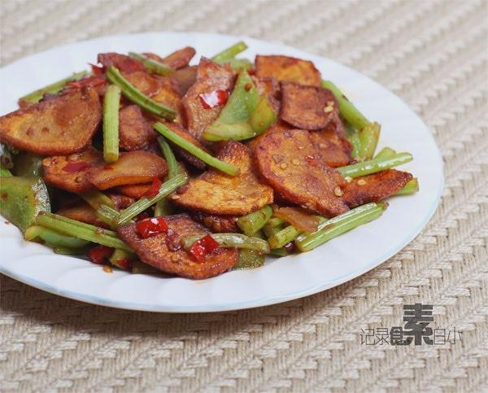

# 干锅土豆片

## 📋 基本資訊 / Recipe Overview
- **料理名稱**：干锅土豆片
- **原始標題**：干锅土豆片
- **素食流派 / Diet**：全素 Vegan
- **料理分類 / Category**：家常蔬食 / 经典热菜
- **來源平台 / Source**：[下廚房 · 素食主義專區](https://www.xiachufang.com/recipe/1002774/)

## 🌿 食材及佐料清單 / Ingredients
- 两个土豆
- 一个青椒
- 两三个朝天椒
- 1大匙郫县豆瓣酱
- 1小匙生抽
- 1/2小匙糖

## 🍳 烹飪步驟 / Step-by-Step Cooking Steps
1. 土豆去皮切稍厚的片，放入水中彻底洗净淀粉。青椒切片，香芹切段，朝天椒切碎
2. 锅烧热下宽油（平时炒菜的两倍），下入沥干水分的土豆片中火煸至表面微微上色捞出
3. 锅中留底油，下切好的朝天椒和一大匙郫县豆瓣炒香，下土豆片翻炒入味
4. 再下青椒和香芹同炒，加一小匙生抽防止过干，出锅前加半小匙糖提味即可

## 💡 大廚美味秘訣 / Chef's Tips
- 1.香芹是家里还剩了两根就随手放了，用青笋更好，不加也可以。 
 2.土豆煸炒的时候用中火，表面微上色即可，不要煸的过干，口感不好。 
3.郫县豆瓣和生抽都有咸味，所以不要再加盐啦~

---
*食譜歸檔時間：2026-08-20 · 來源：下廚房 (www.xiachufang.com)*