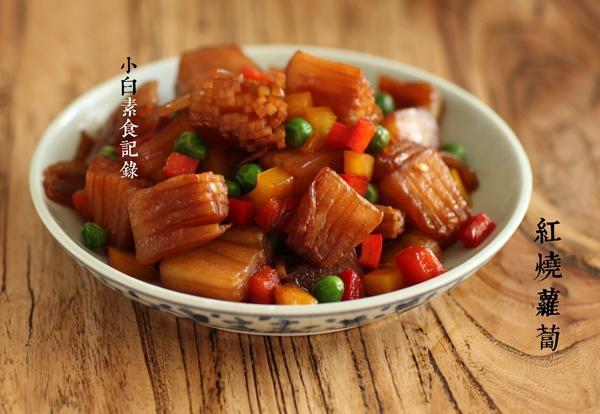

# 快手红烧萝卜

## 📋 基本資訊 / Recipe Overview
- **料理名稱**：快手红烧萝卜
- **原始標題**：快手红烧萝卜
- **素食流派 / Diet**：全素 Vegan
- **料理分類 / Category**：家常蔬食 / 经典热菜
- **來源平台 / Source**：[下廚房 · 素食主義專區](https://www.xiachufang.com/recipe/1075986/)

## 🌿 食材及佐料清單 / Ingredients
- 白萝卜
- 彩椒
- 青豆
- 1小匙老抽
- 1/2小匙盐

## 🍳 烹飪步驟 / Step-by-Step Cooking Steps
1. 萝卜切成长方形的块，大概2*3厘米。然后隔0.5厘米横向向下切，保留0.5厘米，不要切到底，然后竖着切几刀，与刚才的横刀十字交叉，也不要且到底。因为拍的看不太清楚，我用黑线描了下，看图示意，其实是很容易切的，几分钟搞定。
2. 分量的把握。一盘萝卜，小号白萝卜用一根，大号的用半根，配料随意。
3. 锅烧热下油，下切好的萝卜大火爆炒，因为萝卜水分比较多可能会崩油，新手小心点不要吓到~炒到边缘微微焦，下半小碗水和1小匙老抽，煮两分钟，下入彩椒青豆其他配料和盐炒至彩椒断生即可

## 💡 大廚美味秘訣 / Chef's Tips
- 叫快手红烧萝卜，在萝卜块上多切了几刀，这样烧起来很快，即入味又能保持萝卜脆脆的口感，这样的切法，一口咬下去层层叠叠的脆感 
冬吃萝卜，我以前最讨厌吃白萝卜了，但是现在很喜欢，用合适的烹饪方法能够转恨为爱~

---
*食譜歸檔時間：2026-08-20 · 來源：下廚房 (www.xiachufang.com)*