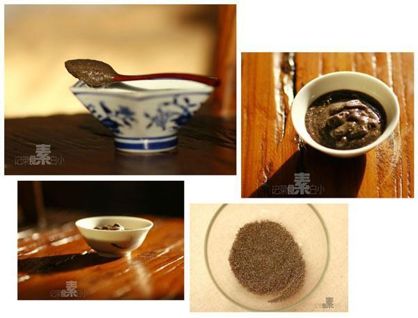

# 手工芝麻糊

## 📋 基本資訊 / Recipe Overview
- **料理名稱**：手工芝麻糊
- **原始標題**：手工芝麻糊
- **素食流派 / Diet**：全素 Vegan
- **料理分類 / Category**：面食主食
- **來源平台 / Source**：[下廚房 · 素食主義專區](https://www.xiachufang.com/recipe/1000464/)

## 🌿 食材及佐料清單 / Ingredients
- 黑芝麻
- 糯米粉
- 糖

## 🍳 烹飪步驟 / Step-by-Step Cooking Steps
1. 生的黑芝麻用小火干炒熟
2. 用料理机或石臼将熟芝麻磨碎
3. 取芝麻三分之一的糯米粉，小火炒至微微发黄
4. 磨好的黑芝麻，炒好的糯米粉，再加点白糖，搅拌均匀，便是手工黑芝麻粉
5. 舀两勺放到碗里，加开水搅拌均匀，浓稠的黑芝麻糊就做好了

## 💡 大廚美味秘訣 / Chef's Tips
- 守住一份宁静。 
之前用豆浆机的米糊功能打了一次芝麻糊，本着不浪费的原则强忍着喝完了，工业的味道。。。 
想起来这回事，就找出过年从家里带的黑芝麻，放到锅里，小火慢慢炒熟，听到有点噼里啪啦的声音就差不多了，芝麻炒过了味道会发苦 
熟芝麻放到石臼里，两杵下去，香气就出来了，顿时脸上都不自觉的有了笑容 
石臼磨芝麻绝对是个体力活，一会儿就出了一身汗 
石臼磨过了，再用面粉筛来筛一下，滤出不够细的芝麻，倒回石臼里，再加点新芝麻，继续磨 
现在，你是否还保留着一份手磨黑芝麻的耐心呢？ 
我们拥有的只是当下

---
*食譜歸檔時間：2026-08-20 · 來源：下廚房 (www.xiachufang.com)*