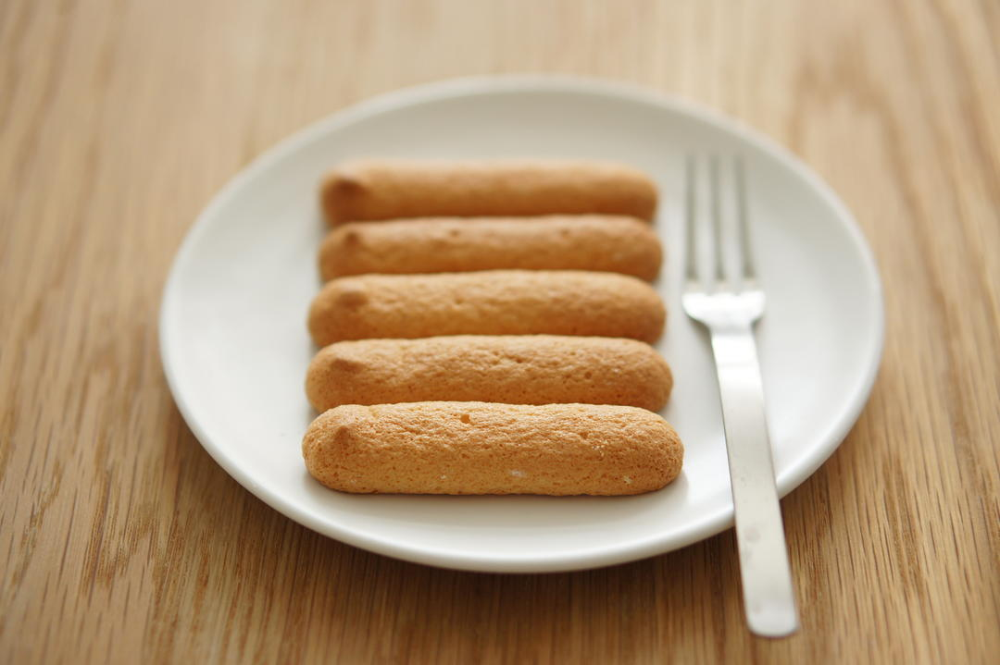

# 手指饼干 分蛋海绵手法详解 「海绵及其衍生」烘焙视频蛋糕篇4

## 📋 基本資訊 / Recipe Overview
- **料理名稱**：手指饼干 分蛋海绵手法详解 「海绵及其衍生」烘焙视频蛋糕篇4
- **原始標題**：手指饼干/分蛋海绵手法详解/「海绵及其衍生」烘焙视频蛋糕篇4
- **素食流派 / Diet**：蛋素 Ovo-Vegetarian
- **料理分類 / Category**：面食主食
- **來源平台 / Source**：[下廚房 · 素食主義專區](https://www.xiachufang.com/recipe/102286244/)

## 🌿 食材及佐料清單 / Ingredients
- 2个鸡蛋
- 60克（10g加入蛋黄，50g加入蛋白）细砂糖
- 60克低筋面粉
- 几滴香草精

## 🍳 烹飪步驟 / Step-by-Step Cooking Steps
1. 准备工作：
烤箱预热到190℃。
2. 裁取宽度约为7cm的纸条，放在铺了硅油纸的烤盘上，边缘轻轻筛上面粉定位。
3. 裱花袋装好中号圆形花嘴（我用三能sn7067）。
准备完成。
4. 制作：
蛋黄中加入10g糖和香草精。
5. 打发至颜色变浅，体积膨大。
6. 打发蛋白，分三次加入50g糖。
7. 直到干性发泡。
8. 低速缓提甩掉蛋白霜。
9. 挖一勺蛋白霜和蛋黄糊拌匀。
（直接用蛋抽扒拉均匀就好）
10. 倒回蛋白霜中。
11. 混合均匀。
（可以用蛋抽，也可以用刮刀。）
12. 筛入低筋面粉。
13. 混合均匀。
（一边用手腕旋转蛋抽，左手一边转动打蛋盆，可以快速均匀的混合面糊。）
14. 面糊会比较稠，用力把打蛋器上的面糊砸回去。
（对真的是砸···）
15. 一旦看不到干粉就停止搅拌。
用刮刀将边缘整理干净。
16. 装入挤花袋里。
17. 在做好标记的烤盘上挤出条状。
18. 190℃，中层，10-12分钟。
至表面金褐色。
有热风功能可以打开。
19. 如果手指饼干冷却后变软了，说明没有烘焙到位，回炉100度烘干就好。
如果冷却后黏在油纸上，也是没有烘焙到位。如果已经上色，回炉，只开下火120℃烘到可以脱离油纸为止。
20. 家用烤箱不比风炉，不能几盘一起烤。这个时候分蛋打发的好处就出来了，面糊状态稳定，可以静置较长时间不会消泡。

市售的手指饼干上会撒上糖粉，但个人并不喜欢（觉得不撒糖蘸咖啡酒不会腻。），如果想要形成脆糖皮，可以筛上糖粉再进行烘焙。

下一期提拉米苏见啦~

## 💡 大廚美味秘訣 / Chef's Tips
- 公众号搜索爱烘焙的阿猪，可以找到提纲挈领的重点详解。

戚风和海绵的区别和区分方法：http://www.xiachufang.com/recipe/102318432/

分蛋打发的面糊更加稳定，一次烤几盘也不会消泡：）
蛋香松脆的手指饼干，不会像市售的一样甜，但是更香。无论是直接吃还是做提拉米苏，都是不错的选择。

做完手指饼干来做全熟提拉米苏~http://www.xiachufang.com/recipe/102293137/
由浅入深的基础烘焙视频合辑：http://www.xiachufang.com/recipe_list/107044141/
问工具型号哒看这个~http://www.xiachufang.com/recipe/102299400/

---
*食譜歸檔時間：2026-08-20 · 來源：下廚房 (www.xiachufang.com)*