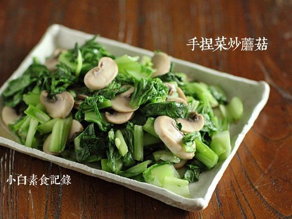

# 手捏菜炒蘑菇

## 📋 基本資訊 / Recipe Overview
- **料理名稱**：手捏菜炒蘑菇
- **原始標題**：手捏菜炒蘑菇
- **素食流派 / Diet**：全素 Vegan
- **料理分類 / Category**：家常蔬食 / 经典热菜
- **來源平台 / Source**：[下廚房 · 素食主義專區](https://www.xiachufang.com/recipe/1069664/)

## 🌿 食材及佐料清單 / Ingredients
- 一捆小白菜（或青菜）
- 五六个口蘑
- 2个干辣椒
- 1小匙盐

## 🍳 烹飪步驟 / Step-by-Step Cooking Steps
1. 口蘑洗净切片待用
2. 小白菜洗净，依喜好切成1-2厘米，加1小匙的盐抓均匀，静置半小时（如果赶时间可以稍微多加一点盐静置几分钟，如果不马上吃，腌个三四个小时味道更好，灵活掌握），如果喜好吃辣，可以在腌的过程中加一点干辣椒碎增添风味，炒之前挤掉过多的水分待用（如不挤掉水分，会过咸，口感也不好）
3. 锅烧热下1大匙油（这道菜如果油放的过少，也不美味）下干辣椒爆香，入蘑菇片炒香，然后下入手捏菜拌炒均匀菜色翠绿即可出锅

## 💡 大廚美味秘訣 / Chef's Tips
- 如果盐放的恰到好处，炒的过程就不需要再放任何调味料了 
切记，如果没有把握，腌的过程中，盐宁少勿多，味道淡了可出锅前再加少许盐

---
*食譜歸檔時間：2026-08-20 · 來源：下廚房 (www.xiachufang.com)*