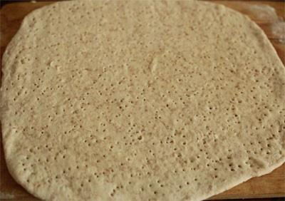

# 披萨饼皮

## 📋 基本資訊 / Recipe Overview
- **料理名稱**：披萨饼皮
- **原始標題**：披萨饼皮
- **素食流派 / Diet**：全素 Vegan
- **料理分類 / Category**：面食主食
- **來源平台 / Source**：[下廚房 · 素食主義專區](https://www.xiachufang.com/recipe/1015394/)

## 🌿 食材及佐料清單 / Ingredients
- 130g高筋面粉
- 30g全麦粉
- 100g35度左右温水
- 1小匙酵母
- 1小匙糖
- 1/2小匙盐
- 1小匙油

## 🍳 烹飪步驟 / Step-by-Step Cooking Steps
1. 将高粉和全麦粉混合均匀，如果喜欢更粗糙或更营养可适量增加全麦粉比例
2. 将温水与酵母、糖、盐、油混合均匀，静置10分钟待用
3. 将水混合物与面粉混合均匀，揉成光滑面团，然后容器底撒上面粉，将面团放入，盖上保鲜膜入冰箱冷藏一夜后取出，面团里发酵成蜂窝状。将面团按压排气，继续放在温暖地方发酵至两倍大小（低温发酵适合第二天要招待客人，提前揉好面准备，不但节省时间还可以获得更好的口感，面团在低温发酵状态可在冰箱保存三天。如果时间限制可省略掉低温发酵步骤，直接将面团放在温暖地方发酵两倍大小即可）
4. 将发酵好的面团擀成0.5厘米厚的饼，用叉子随意扎上眼即可。如果为了节省时间，可以一次多做些，擀好后放平盘上入冰箱冷冻，冻实取出入密封袋继续冷冻保存，随吃随取。（尽量在两个月内食用）

## 💡 大廚美味秘訣 / Chef's Tips
- 冷冻食品储存越久风味越差，还是尽量早食用 
另外低温发酵法时候大多数需要发面的东东，非常食用，不用怕温度过高面会变酸，还可以发酵的非常完美，力荐

---
*食譜歸檔時間：2026-08-20 · 來源：下廚房 (www.xiachufang.com)*