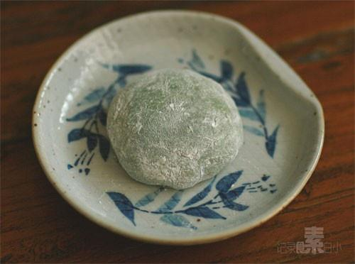

# 抹茶红豆大福

## 📋 基本資訊 / Recipe Overview
- **料理名稱**：抹茶红豆大福
- **原始標題**：抹茶红豆大福
- **素食流派 / Diet**：全素 Vegan
- **料理分類 / Category**：面食主食
- **來源平台 / Source**：[下廚房 · 素食主義專區](https://www.xiachufang.com/recipe/1000558/)

## 🌿 食材及佐料清單 / Ingredients
- 50G糯米粉
- 适量红豆沙
- 50g白糖
- 90g水
- 一勺抹茶粉

## 🍳 烹飪步驟 / Step-by-Step Cooking Steps
1. 糯米粉，白糖，水，抹茶粉混合搅拌均匀
2. 盖上保鲜膜微波炉高火2分钟，去除搅拌成团
3. 均匀覆盖玉米淀粉防止沾手，将糯米团分成四份
4. 压成饼状，中间裹住红豆沙球，包严即可

## 💡 大廚美味秘訣 / Chef's Tips
- 很多童鞋都说到粘手的问题，很正常，最简单的处理方法就是手上多撒点分，最后团成团了再撒上粉防粘盘子

---
*食譜歸檔時間：2026-08-20 · 來源：下廚房 (www.xiachufang.com)*