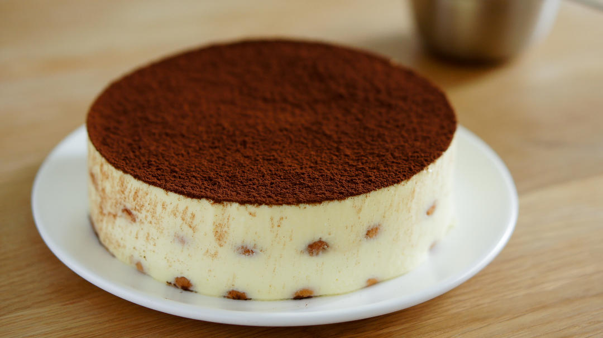

# 提拉米苏 简易蛋黄消毒法，手指饼干不漂浮的要点。 「海绵及其衍生」烘焙视频蛋糕篇4

## 📋 基本資訊 / Recipe Overview
- **料理名稱**：提拉米苏 简易蛋黄消毒法，手指饼干不漂浮的要点。 「海绵及其衍生」烘焙视频蛋糕篇4
- **原始標題**：提拉米苏/简易蛋黄消毒法，手指饼干不漂浮的要点。/「海绵及其衍生」烘焙视频蛋糕篇4
- **素食流派 / Diet**：蛋奶素 Ovo-Lacto
- **料理分類 / Category**：面食主食
- **來源平台 / Source**：[下廚房 · 素食主義專區](https://www.xiachufang.com/recipe/102293137/)

## 🌿 食材及佐料清單 / Ingredients
- 250g马斯卡彭
- 150g淡奶油
- 60克细砂糖
- 2个蛋黄
- 1片（5g）吉利丁片
- 2包（或浓缩咖啡一杯）速溶黑咖啡粉
- 15g咖啡酒
- 200g手指饼干

## 🍳 烹飪步驟 / Step-by-Step Cooking Steps
1. 准备工作：
1.将吉利丁片用冰水泡软。
2.用保鲜膜把慕斯圈底部扎紧。
2. 制作蛋黄糊。
40g水+60g砂糖煮开，离火静置至温热。
3. 蛋黄打散，边搅拌边倒入温热的糖水。
4. 3.放入微波炉加热。
5. 微波炉每次加热30秒，取出搅拌均匀。
重复上述步骤2-3次，直至蛋黄糊变稠。
（如果微波炉有加热档位，请使用中火或中大火。）
（蛋黄糊取出时会有气孔，不用担心，搅拌均匀即可。）
6. 取出蛋黄糊过筛。
筛去结块蛋白，过筛后用刮刀把筛网背面刮干净。
7. 打发蛋黄糊，直到体积膨胀，颜色发白。
蛋黄糊制作完成。
8. 制作提拉米苏慕斯液。
将蛋黄糊倒入马斯卡彭中，低速打匀。
（打匀马上停手，马斯卡彭容易打过头变粗糙）
9. 吉利丁片沥去水分，微波10秒融化。
（吉利丁片的分量可以酌情增减，这个分量是入口即溶但能保持蛋糕成型。如果做杯装提拉米苏，可以省略；如果要长途跋涉，可以增加1片吉利丁片确保稳定。）
10. 倒入马斯卡彭中，混合均匀。
11. 打发淡奶油，直至成为固体。
注意：淡奶油要打硬！
要打硬！
打硬！
打不硬待会手指饼干会飘起来！
（妈啊下厨房没法加粗字真是急死我···）
12. 和马斯卡彭混合均匀。
13. 提拉米苏慕斯液完成。
14. 组装。
2包速溶黑咖啡用50g沸水冲开。
（如果有条件，可以现磨一杯意式浓缩咖啡）
加入咖啡酒混合均匀。
15. 铺一层手指饼干。
16. 刷上咖啡液。
（手指饼干吸水性惊人，用刷而非蘸的手法可以避免吸收太多浓咖啡太苦太湿，如果喜欢湿透了的口感可以在咖啡里蘸一下。）
17. 倒入一半慕斯液。
18. 铺上第二层手指饼干，重复上述步骤。
19. 从20cm高处，从中心向四周，消去大气泡同时利用重力压实手指饼干。
20. 拇指固定慕斯圈，双手轻轻前后移动慕斯垫片，使溶液表面平整。
21. 冷藏一夜（至少4小时以上）
（冻久一点，待会撕掉保鲜膜的时候不会毁容）
蛋糕主体完成。
22. 脱模及装饰。
确定蛋糕冻结实（对，功败垂成所以我要再啰嗦一次）之后，把蛋糕立起来，撕去底部保鲜膜。
23. 用喷枪或电吹风脱模。
注意转动，均匀受热。
24. 轻轻上提，脱出慕斯圈。
（如果有粘附的地方，不要死拉硬拽，松手拿喷枪或吹风机加热一下。）
25. 最后，轻轻撒上可可粉。
可可粉适量就好，太多可能会呛到。
26. 可以开动啦~

## 💡 大廚美味秘訣 / Chef's Tips
- 公众号搜索爱烘焙的阿猪，可以找到提纲挈领的重点详解。

提拉米苏的保留配方，丝滑细腻的马斯卡彭入口即化，混合咖啡和可可带来丰富和谐的口感。
传统的提拉米苏需要添加生蛋黄，但不少人有所顾虑，熬煮糖浆又不好掌握。今天和大家分享通过微波炉消毒蛋液的做法，更加适合家庭操作。

看完视频可以掌握：
1.如何简单快捷制作全熟蛋黄糊？
2.如何制作细腻丝滑的提拉米苏溶液？
3.如何使慕斯圈不漏液？
（半夜擦冰箱的血泪教训_(:зゝ∠)_）
4.如何使手指饼干不漂浮？
（每次看到一堆饼底在浮潜很头大有木有？）
5.如何使表面光滑平整？

由浅入深的基础烘焙视频合辑：http://www.xiachufang.com/recipe_list/107044141/
问工具型号哒看这个~http://www.xiachufang.com/recipe/102299400/

---
*食譜歸檔時間：2026-08-20 · 來源：下廚房 (www.xiachufang.com)*