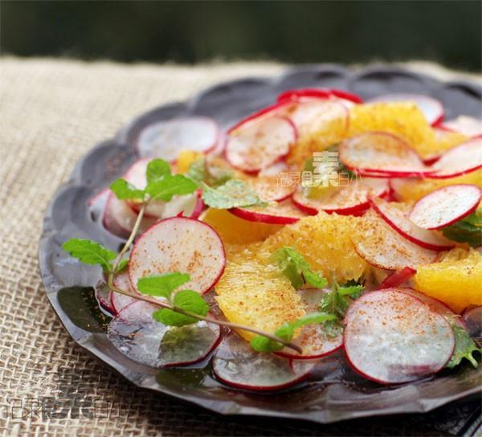

# 摩洛哥风味甜橙小萝卜沙拉

## 📋 基本資訊 / Recipe Overview
- **料理名稱**：摩洛哥风味甜橙小萝卜沙拉
- **原始標題**：摩洛哥风味甜橙小萝卜沙拉
- **素食流派 / Diet**：全素 Vegan
- **料理分類 / Category**：面食主食
- **來源平台 / Source**：[下廚房 · 素食主義專區](https://www.xiachufang.com/recipe/1005186/)

## 🌿 食材及佐料清單 / Ingredients
- 200g樱桃萝卜（或水萝卜）
- 一个甜橙
- 1小匙白糖
- 1大匙橄榄油·
- 1大匙柠檬汁
- 一点点肉桂粉
- 少许（可略）薄荷叶

## 🍳 烹飪步驟 / Step-by-Step Cooking Steps
1. 樱桃萝卜洗净切成薄片，甜橙切掉外皮
2. 顺着橙子瓣的方向向内切，这样轻松取出橙肉，其余会剩一点点就直接挤汁到大碗中
3. 橙子肉和萝卜片也放入大碗中，加入橄榄油、砂糖、柠檬汁拌匀装盘
4. 最后点缀薄荷叶（我是自己种的），再撒一点点的肉桂粉即可

## 💡 大廚美味秘訣 / Chef's Tips
- 从摩洛哥菜谱上学来的，同学翻菜谱时说这个看起来很有食欲，让我做一个，哈哈，脸皮很厚的说我拍出来滴比原菜谱好看多了。。 
 
原菜谱中有一个橙花水，这个在国内实在是不好找，省略掉了，但是味道还是芳香浓郁的 
甜橙和柠檬有层次的自然酸

---
*食譜歸檔時間：2026-08-20 · 來源：下廚房 (www.xiachufang.com)*