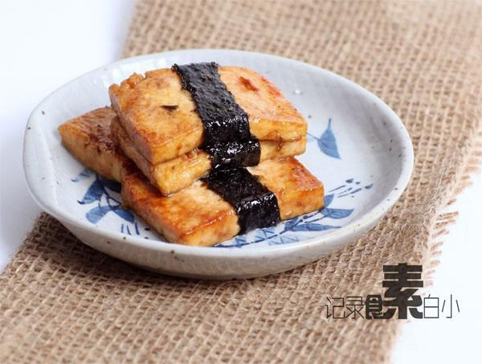

# 日式照烧海苔豆腐

## 📋 基本資訊 / Recipe Overview
- **料理名稱**：日式照烧海苔豆腐
- **原始標題**：日式照烧海苔豆腐
- **素食流派 / Diet**：全素 Vegan
- **料理分類 / Category**：面食主食
- **來源平台 / Source**：[下廚房 · 素食主義專區](https://www.xiachufang.com/recipe/1003048/)

## 🌿 食材及佐料清單 / Ingredients
- 一块北豆腐
- 一张海苔
- 1大匙干淀粉
- 3大匙生抽
- 1大匙白糖
- 1小匙姜末

## 🍳 烹飪步驟 / Step-by-Step Cooking Steps
1. 一块北豆腐切成16--20片左右的厚长方片，海苔剪成豆腐片长度1/3宽的条
2. 利用豆腐本身的湿度用海苔条裹住豆腐，多余的剪掉
3. 裹好的海苔豆腐沾少许干淀粉
4. 锅烧热下油，放入海苔豆腐小火煎至表面微微发黄
5. 倒入用生抽 3大匙、白糖1大匙、姜末 1小匙混合成的照烧汁小火收汁入味即可

## 💡 大廚美味秘訣 / Chef's Tips
- 味道偏甜但是没有想象中的甜，口味浓郁很适合下饭 
烧过的海苔口味口感跟里面的豆腐形成对比~真心好吃，喜欢的试试吧~

---
*食譜歸檔時間：2026-08-20 · 來源：下廚房 (www.xiachufang.com)*