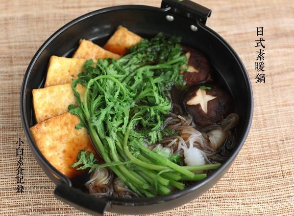

# 日式素暖锅

## 📋 基本資訊 / Recipe Overview
- **料理名稱**：日式素暖锅
- **原始標題**：日式素暖锅
- **素食流派 / Diet**：全素 Vegan
- **料理分類 / Category**：家常蔬食 / 经典热菜
- **來源平台 / Source**：[下廚房 · 素食主義專區](https://www.xiachufang.com/recipe/1073027/)

## 🌿 食材及佐料清單 / Ingredients
- 半块北豆腐
- 一把蒿子秆
- 五六朵香菇
- 适量魔芋
- 60ml（4大匙）生抽
- 2大匙糖
- 150ml水

## 🍳 烹飪步驟 / Step-by-Step Cooking Steps
1. 备料，蔬菜洗净。魔芋用丝或结都可以，要放入开水中焯一下去腥味。蒿子秆就是小叶茼蒿，用它的原因一是当季，再就是我觉得蒿子秆烫火锅最好吃啦~
2. 北豆腐切片，放入锅中加少油略煎一下（通常寿喜锅用烤豆腐，我觉得煎的也不错，在家好操作）香菇去蒂，用刀在表面切漂亮的十字，注意~如果只是在香菇表面划十字的话，煮出来是不会变成这样滴
3. 将生抽、糖和水放入锅中烧开，然后码入煎豆腐、魔芋、香菇煮个三五分钟，放上一把蒿子秆，盖上盖子闷一下拌匀开吃~

## 💡 大廚美味秘訣 / Chef's Tips
- 我用的是小的锅，所以用的调料汁并不多，这个分量适合1-2人如果人多要适当增加调料和主料（给大家更直观点的参考，这个锅的直径不到20） 
对了，超市买的真空包装的乌冬面，最好烹饪之前也要焯一下水，否则有点味道 
日式火锅的水不要太多，这个比例咸淡刚好

---
*食譜歸檔時間：2026-08-20 · 來源：下廚房 (www.xiachufang.com)*