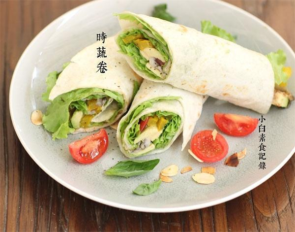

# 时蔬卷饼

## 📋 基本資訊 / Recipe Overview
- **料理名稱**：时蔬卷饼
- **原始標題**：时蔬卷饼
- **素食流派 / Diet**：全素 Vegan
- **料理分類 / Category**：面食主食
- **來源平台 / Source**：[下廚房 · 素食主義專區](https://www.xiachufang.com/recipe/1064459/)

## 🌿 食材及佐料清單 / Ingredients
- 四张卷饼皮
- 一棵生菜
- 一个牛油果（酪梨）
- 一个彩椒
- 适量平菇
- 几个圣女果
- 1大匙杏仁片（或其他坚果）
- 1大匙黄芥末酱（或其他喜欢的酱）
- 1/2小匙盐
- 一点点黑胡椒粉

## 🍳 烹飪步驟 / Step-by-Step Cooking Steps
1. 所有蔬菜洗净，把需要炒熟的平菇撕成条，彩椒切条，放入加了少许油的锅中炒熟，加少许盐和胡椒粉调味，其他生食的蔬菜，圣女果切开，牛油果去皮去核切片待用。杏仁片用平底锅小火干烤香待用。
2. 取卷饼皮（卷饼皮就是做墨西哥卷的那种，大型超市或淘宝都很容易买到，本身是熟的，吃的时候热一下即可，冷冻可保存很久）放入加热好的平底锅中加热两面烤软待用。首先在饼的中央抹上黄芥末酱（是芥末籽做的酱，不是日本料理里的青芥末哦）然后铺上生菜，摆上炒好的平菇和彩椒，切好的圣女果和牛油果，撒上烤好的杏仁片，从一端卷起，卷的紧一点，然后斜切两段即可。

## 💡 大廚美味秘訣 / Chef's Tips
- 蔬菜根据情况灵活调整~ 
虽然种类很多但是并不麻烦，晚上睡觉前洗好菜放入冰箱，早上加工一下就好了 
记住每天要多吃几种蔬菜哦

---
*食譜歸檔時間：2026-08-20 · 來源：下廚房 (www.xiachufang.com)*