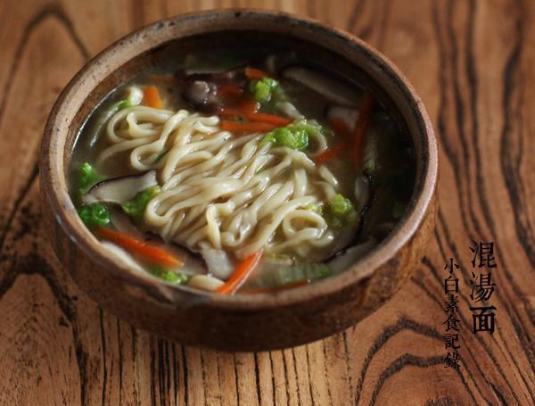

# 朴素的混汤面

## 📋 基本資訊 / Recipe Overview
- **料理名稱**：朴素的混汤面
- **原始標題**：朴素的混汤面
- **素食流派 / Diet**：全素 Vegan
- **料理分類 / Category**：面食主食
- **來源平台 / Source**：[下廚房 · 素食主義專區](https://www.xiachufang.com/recipe/1074343/)

## 🌿 食材及佐料清單 / Ingredients
- 一人份鲜面条
- 三四片白菜
- 一段胡萝卜
- 三四朵新鲜香菇
- 1/2小匙盐
- 两粒冰糖
- 1小匙生抽
- 1大碗水

## 🍳 烹飪步驟 / Step-by-Step Cooking Steps
1. 白菜洗净切丝，胡萝卜去皮切丝，香菇去蒂切丝待用
2. 锅烧热下1大匙的油，入香菇丝大火煸香，边缘微焦香味四溢，下胡萝卜丝和白菜炒匀，倒入一大碗水（冷的热的皆可），锅中发出呲啦的响声，水烧开后转中火，下入面条、盐、生抽、冰糖煮至面条熟了即可）根据面条粗细不同时间也是1-5分钟不等，自己掌握。开吃

## 💡 大廚美味秘訣 / Chef's Tips
- 在杭州的一个镇子上，台州夫妇俩开了一家面馆，各种面，我点了一碗素面。香浓极了，我最后连汤几乎都喝掉，缺点是味精放太多，让我之后连续口渴好半天，好吃的面让我不禁揣摩起做法，回到北京后实践了好几次，还做给好友们吃，大家都挺喜欢。 
 这个面的做法跟我小时候最爱的自家做的土豆豆角面一个做法，想要做的好吃，首先面条无论是纯手工的还是机器压的，都必须要新鲜湿润的，另外最重要的一点就是爆锅了。菜料备好，面条准备妥当，锅烧热下油，入菜料大火爆香，然后冲入水，听到油水结合时诱人的“呲啦”的声。水开后下面，下调料，面煮熟即可。混汤面之所以叫这个名，汤必须是浑浊的，喝起来又暖又香。煮这个面一定要配上中式炒勺才有感觉 
 就在刚刚，再次来到杭州，我的午饭又去了那家小面馆，点了一碗姜汤面，让我在这个湿冷的地方立马暖透到脚底，做法就是在此基础上，加了点姜汁 
 以下做法是几天前在京做的，用的是北方冬天最常见朴素的三种食材，胡萝卜、白菜、香菇。如果想要豪华版，再切点豆干笋丝（笋要先用水加盐煮几分钟去涩），白菜换成塌菜也极棒。 
 这种鲜面条可以一次多买点，分成一份一份冷冻，随吃随取很方便，不影响风味~ 
 混汤面对我来说，是温暖方便的家常便饭，这一碗主食和菜全都包括，学会照顾自己。这面就像北方灰灰的冬天，南方的风景更香丝丝分明的阳春面

---
*食譜歸檔時間：2026-08-20 · 來源：下廚房 (www.xiachufang.com)*