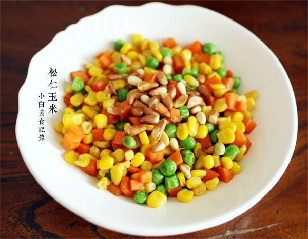

# 松仁玉米

## 📋 基本資訊 / Recipe Overview
- **料理名稱**：松仁玉米
- **原始標題**：松仁玉米
- **素食流派 / Diet**：全素 Vegan
- **料理分類 / Category**：面点小吃
- **來源平台 / Source**：[下廚房 · 素食主義專區](https://www.xiachufang.com/recipe/1016397/)

## 🌿 食材及佐料清單 / Ingredients
- 适量速冻青豆
- 一包速冻甜玉米粒
- 半根胡萝卜
- 2大匙松仁
- 1/2小匙盐

## 🍳 烹飪步驟 / Step-by-Step Cooking Steps
1. 速冻甜玉米粒一包拿出来解冻，速冻青豆也解冻，如果用新鲜的甜玉米和新鲜青豆需要把玉米粒用刀切下，然后放入开水锅中烫两三分钟煮熟捞出，然后过凉水，青豆也是这样。胡萝卜去皮切成和玉米粒大小差不多的丁
2. 锅烧热下少许油，如果用生松子这时下入松子小火翻炒一下，接着下胡萝卜同炒至断生，接着下青豆玉米粒快速翻炒几下，加入盐炒匀调味即可。如果用熟松子的话最后再放即可

## 💡 大廚美味秘訣 / Chef's Tips
- 有的菜重调味，有的菜则要做减法调味，这道菜如果再加生抽和糖之类的反而会破坏菜肴的鲜美清爽

---
*食譜歸檔時間：2026-08-20 · 來源：下廚房 (www.xiachufang.com)*