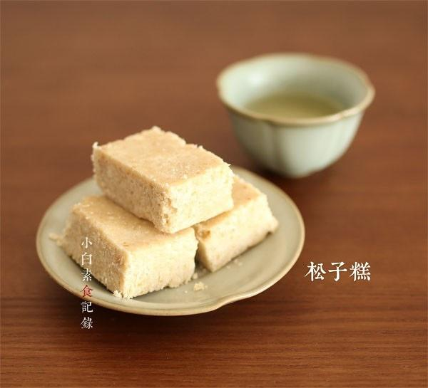

# 松子糕

## 📋 基本資訊 / Recipe Overview
- **料理名稱**：松子糕
- **原始標題**：松子糕
- **素食流派 / Diet**：全素 Vegan
- **料理分類 / Category**：面食主食
- **來源平台 / Source**：[下廚房 · 素食主義專區](https://www.xiachufang.com/recipe/1014422/)

## 🌿 食材及佐料清單 / Ingredients
- 200g糯米粉
- 50g松子仁
- 100g糖
- 100g水
- 20g香油

## 🍳 烹飪步驟 / Step-by-Step Cooking Steps
1. 将生的糯米粉放入不粘锅中，用最小火干炒至微微有一点点发黄，有香气，期间要不断的翻炒，不可偷懒，大概200g粉要炒10分钟左右。松子仁如果是生的也需要小火干炒熟（有香味且有噼里啪啦的声音即可），熟松子仁用研磨机打碎（用擀面杖压碎也可）
2. 将炒熟的糯米粉和松子碎混合均匀，用手搓至没有颗粒疙瘩。糖和等重的水放入锅中小火加热至糖完全融化，没有颗粒即可关火自然晾凉
3. 将糖水与松子仁糯米粉混合物，还有香油一起混合均匀，用手继续搓均匀没有颗粒，然后将混合物压在容器中用力压实（用手压，用平底勺压都可以，关键是用力，压实，压平）用小刀划开，扣出就是一块块的松子糕了

## 💡 大廚美味秘訣 / Chef's Tips
- 松子糕是江浙一带的传统茶点，以前吃过，入口即化，松子清香，正巧家里有别人送的松子，自己琢磨配方居然很成功。通常用来配茶的点心都是比较甜的，切成一小块一小块，别贪吃哦.做法原料都不复杂，而且不需要烤箱，松子也可以换成其他自己喜欢的坚果。以下是12块左右的分量

---
*食譜歸檔時間：2026-08-20 · 來源：下廚房 (www.xiachufang.com)*