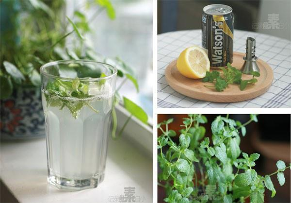

# 柠檬薄荷苏打水

## 📋 基本資訊 / Recipe Overview
- **料理名稱**：柠檬薄荷苏打水
- **原始標題**：柠檬薄荷苏打水
- **素食流派 / Diet**：全素 Vegan
- **料理分類 / Category**：家常蔬食 / 经典热菜
- **來源平台 / Source**：[下廚房 · 素食主義專區](https://www.xiachufang.com/recipe/1000784/)

## 🌿 食材及佐料清單 / Ingredients
- 半个柠檬
- 一听苏打水
- 少许薄荷叶

## 🍳 烹飪步驟 / Step-by-Step Cooking Steps
1. 柠檬半个榨汁，加入苏打水和捣过的薄荷叶即可
2. 个人喜欢喝不加糖的，也可以根据个人口味加糖~

## 💡 大廚美味秘訣 / Chef's Tips
- 在夏天最喜欢喝的饮料~ 
特别简单清爽

---
*食譜歸檔時間：2026-08-20 · 來源：下廚房 (www.xiachufang.com)*