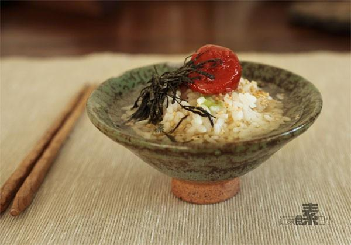

# 梅子茶泡饭

## 📋 基本資訊 / Recipe Overview
- **料理名稱**：梅子茶泡饭
- **原始標題**：梅子茶泡饭
- **素食流派 / Diet**：全素 Vegan
- **料理分類 / Category**：米食主食
- **來源平台 / Source**：[下廚房 · 素食主義專區](https://www.xiachufang.com/recipe/1009040/)

## 🌿 食材及佐料清單 / Ingredients
- 少许海苔丝
- 一碗米饭
- 一颗盐渍紫苏梅
- 1小匙熟芝麻
- 1/2小匙盐
- 1/2小匙日本酱油
- 少许绿芥末
- 适量玄米茶

## 🍳 烹飪步驟 / Step-by-Step Cooking Steps
1. 将米饭盛到碗中，撒上盐、酱油、熟芝麻、海苔丝最后摆上梅子
2. 用烫烫的水沏茶，倒入碗中，没过米饭2/3处即可

## 💡 大廚美味秘訣 / Chef's Tips
- 梅子：要买日式的盐渍黄梅，淘宝有售 
茶：通常用日式玄米茶或煎茶，总而言之是蒸青绿茶，没有的话普通绿茶也可 
芥末：可有可无，根据个人口味 
 
梅子酸的过瘾，第一口下去就停不下来了，开胃的好东西~必须连吃好几碗 
茶泡饭，只要细嚼慢咽就不会消化不良~

---
*食譜歸檔時間：2026-08-20 · 來源：下廚房 (www.xiachufang.com)*