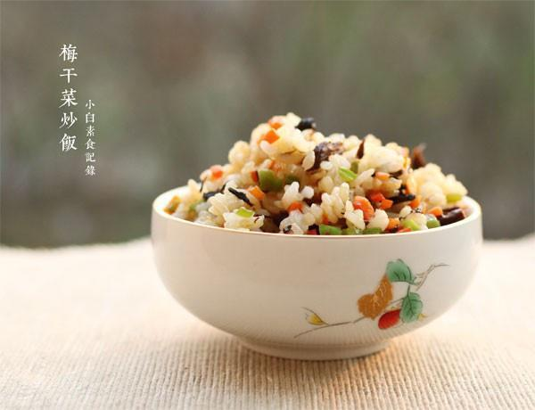

# 梅干菜炒饭

## 📋 基本資訊 / Recipe Overview
- **料理名稱**：梅干菜炒饭
- **原始標題**：梅干菜炒饭
- **素食流派 / Diet**：全素 Vegan
- **料理分類 / Category**：米食主食
- **來源平台 / Source**：[下廚房 · 素食主義專區](https://www.xiachufang.com/recipe/1040726/)

## 🌿 食材及佐料清單 / Ingredients
- 两碗米饭
- 一个尖椒
- 半根胡萝卜
- 一把梅干菜
- 1/2小匙盐
- 1/2小匙糖
- 1小匙生抽

## 🍳 烹飪步驟 / Step-by-Step Cooking Steps
1. 梅干菜用水泡10分钟左右泡软捞出挤掉水分。胡萝卜切碎，尖椒去蒂去籽切碎。米饭搅散待用。
2. 锅烧热下宽油，下梅干菜炒香，接着下胡萝卜超软，然后下尖椒碎略炒，下米饭一起中小火翻炒均匀，下盐、糖、生抽调味炒匀即可

## 💡 大廚美味秘訣 / Chef's Tips
- 1.炒饭的米饭不一定要隔夜，最好要稍硬一些的，这样炒出来粒粒分明，而且炒之前要搅拌散，不要有结团的 
2.炒饭油要稍微多一点，这样炒出来的饭很香不会粘锅，当然油不能太多，否则就腻了 
3.炒米饭一定要勤翻炒，炒的时间稍长些，这样每一粒米都会看起来很精神，亮亮的 
总之，炒饭容易炒好难~技术活多练练就好啦

---
*食譜歸檔時間：2026-08-20 · 來源：下廚房 (www.xiachufang.com)*