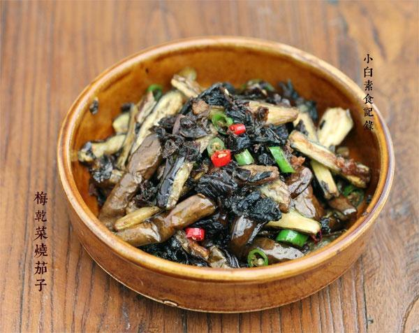

# 梅干菜烧茄子

## 📋 基本資訊 / Recipe Overview
- **料理名稱**：梅干菜烧茄子
- **原始標題**：梅干菜烧茄子
- **素食流派 / Diet**：全素 Vegan
- **料理分類 / Category**：家常蔬食 / 经典热菜
- **來源平台 / Source**：[下廚房 · 素食主義專區](https://www.xiachufang.com/recipe/1055058/)

## 🌿 食材及佐料清單 / Ingredients
- 三根茄子
- 一把梅干菜
- 各一根青红椒
- 1/2小匙盐
- 2大匙生抽
- 1/2小匙糖

## 🍳 烹飪步驟 / Step-by-Step Cooking Steps
1. 青红小辣椒切碎，梅干菜用水泡20分钟左右泡软洗净，挤掉水分待用。茄子去蒂切成条，撒上1/2小匙盐拌匀静置十几分钟，此时茄子会出水，倒出水待用（此步骤也是为了在煸的过程中茄子少吸油，而且茄子会更入味）
2. 锅中放适量油，下处理过的茄子条煸软
3. 煸好的茄子倒出，利用刚才煸茄子的油继续加热，下梅干菜煸炒至香酥，接着把青红椒倒入翻炒，然后下入茄子，2大匙生抽，1/2小匙糖和半碗水，翻炒均匀收汁浓稠即可出锅

## 💡 大廚美味秘訣 / Chef's Tips
- 梅干菜的浓郁与茄子同烧也是灰常下饭滴 
建议一切放了梅干菜的菜肴里都放一点点糖~极搭 
梅干菜的挑选：酱油色、少沙子、最重要的就是闻一闻，味道香浓的为佳~

---
*食譜歸檔時間：2026-08-20 · 來源：下廚房 (www.xiachufang.com)*