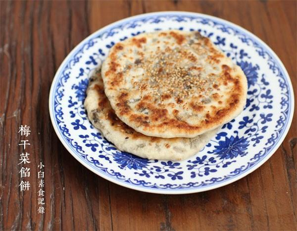

# 梅干菜馅饼

## 📋 基本資訊 / Recipe Overview
- **料理名稱**：梅干菜馅饼
- **原始標題**：梅干菜馅饼
- **素食流派 / Diet**：全素 Vegan
- **料理分類 / Category**：面食主食
- **來源平台 / Source**：[下廚房 · 素食主義專區](https://www.xiachufang.com/recipe/1044586/)

## 🌿 食材及佐料清單 / Ingredients
- 饼皮：
- 250g普通面粉
- 130g温水
- 2小匙酵母
- 2小匙糖
- 馅料：
- 50g梅干菜
- 40g榨菜
- 1大匙生抽
- 1大匙油

## 🍳 烹飪步驟 / Step-by-Step Cooking Steps
1. 干梅干菜用水浸泡20分钟泡软，挤掉水分，切碎。榨菜切碎，与梅干菜碎，2小匙糖，1大匙生抽，1大匙油拌匀。将拌好的馅放入锅中炒香待用。
2. 将饼皮中的所有材料混合揉成光滑面团，盖上保鲜膜或湿布醒半小时，冷天就要放到温暖的地方发酵。或者头一天晚上和好面，盖上保鲜膜放入冰箱冷藏，第二天拿出直接用
3. 将发酵好的面团搓成圆柱，切成8等分。取一份压扁，擀成薄饼，放入1大匙馅料。
4. 像包包子一样捏褶封口，压扁，再擀成比较薄的饼，不要怕擀漏了，面皮微微透着馅料最好吃。
5. 放入抹了少许油的平底锅中，小火烙至两面金黄即可
6. （如果喜欢，可以在擀好的饼上，用手抹一点水，然后沾些熟芝麻，然后再烙饼~）

## 💡 大廚美味秘訣 / Chef's Tips
- 以前做过梅干菜酥饼，酥皮制作费时费力，今天上个省事的馅饼，口感是跟酥饼不一样，也好吃 
以下是8个小饼的分量

---
*食譜歸檔時間：2026-08-20 · 來源：下廚房 (www.xiachufang.com)*