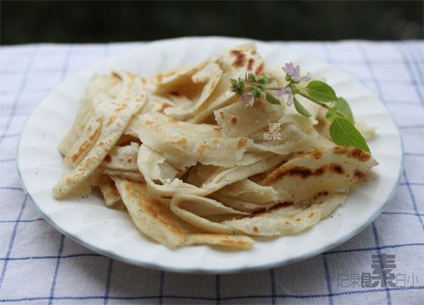

# 椒盐手抓饼

## 📋 基本資訊 / Recipe Overview
- **料理名稱**：椒盐手抓饼
- **原始標題**：椒盐手抓饼
- **素食流派 / Diet**：全素 Vegan
- **料理分類 / Category**：面食主食
- **來源平台 / Source**：[下廚房 · 素食主義專區](https://www.xiachufang.com/recipe/1005932/)

## 🌿 食材及佐料清單 / Ingredients
- 200g普通面粉
- 150ml温水
- 1大匙油
- 1小匙椒盐

## 🍳 烹飪步驟 / Step-by-Step Cooking Steps
1. 将面粉与温水搅拌均匀，揉成柔软的光滑面团，盖上湿布醒20分钟
2. 将面团分成2等分，取其中一份擀成薄饼（比饺子皮略厚）
3. 均匀涂上油和椒盐的混合物，折成风琴褶（如图），然后从一端盘起成圆形
4. 压扁，擀成饼，平底锅涂少许油，放入饼中小火每面烙一二分钟即可

## 💡 大廚美味秘訣 / Chef's Tips
- 1.这个面用温水和热水都可以，热水和的会更劲道一些。 
2.面团要和的比较柔软，比平常包饺子的面软很多 
3.其他口味比如甜的，也不错 
4.一个饼用100g面粉，100g面粉用75ml水，根据情况来和面 
烙好的饼，用手一抓就散开了~~好香，开吃

---
*食譜歸檔時間：2026-08-20 · 來源：下廚房 (www.xiachufang.com)*