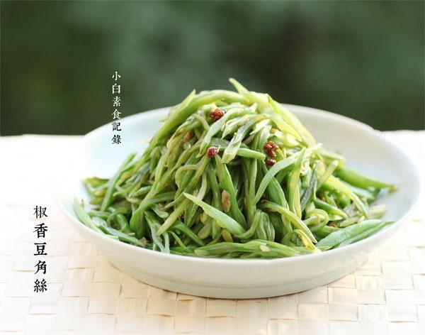

# 椒香豆角丝

## 📋 基本資訊 / Recipe Overview
- **料理名稱**：椒香豆角丝
- **原始標題**：椒香豆角丝
- **素食流派 / Diet**：全素 Vegan
- **料理分類 / Category**：家常蔬食 / 经典热菜
- **來源平台 / Source**：[下廚房 · 素食主義專區](https://www.xiachufang.com/recipe/1052936/)

## 🌿 食材及佐料清單 / Ingredients
- 400g宽扁豆
- 1大匙花椒粒
- 1/2小匙盐
- 1/4小匙糖
- 1大匙生抽

## 🍳 烹飪步驟 / Step-by-Step Cooking Steps
1. 宽扁豆去掉两端，顺势撕掉老筋，洗净，用刀斜切成丝
2. 锅烧热下少许油，下花椒粒小火至香气出来，下入切好的扁豆丝，中火不断翻炒豆角又生绿变翠绿然后变成橄榄绿，变软了，这样豆角都彻底炒熟了，加入盐糖生抽炒匀调味即可
3. 豆角一定要炒熟，没熟透会食物中毒哦 
豆角切丝了比较容易熟，按照我说的观察变化：生绿变翠绿然后变的颜色更深一点，豆角丝软了，这样就肯定熟了，不要炒到黑乎乎哦

## 💡 大廚美味秘訣 / Chef's Tips
- 宽扁豆，切丝 
花椒爆香，家常应季小炒 
要挑选图上的这种宽扁豆适合切丝，那种圆鼓鼓的很容易切到手 
拿不准就问问卖菜阿姨大叔~

---
*食譜歸檔時間：2026-08-20 · 來源：下廚房 (www.xiachufang.com)*