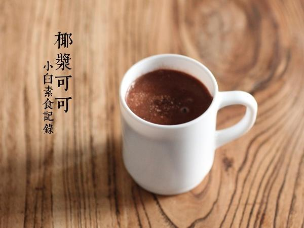

# 椰浆可可

## 📋 基本資訊 / Recipe Overview
- **料理名稱**：椰浆可可
- **原始標題**：椰浆可可
- **素食流派 / Diet**：全素 Vegan
- **料理分類 / Category**：面食主食
- **來源平台 / Source**：[下廚房 · 素食主義專區](https://www.xiachufang.com/recipe/1081962/)

## 🌿 食材及佐料清單 / Ingredients
- 2大匙可可粉
- 90ml椰浆（减脂）
- 1大匙糖
- 150ml热水

## 🍳 烹飪步驟 / Step-by-Step Cooking Steps
1. 做法极其简单，如果你用椰浆，就把所有原料一起放小锅煮沸即可。如果用的椰浆粉，3大匙就够了，不用煮，用沸水冲开就好了~

## 💡 大廚美味秘訣 / Chef's Tips
- 减脂椰浆就是淡椰浆，浓的椰浆有点腻

---
*食譜歸檔時間：2026-08-20 · 來源：下廚房 (www.xiachufang.com)*