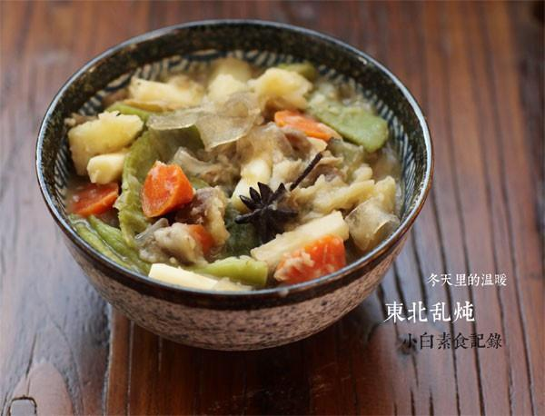

# 没有灵魂的豪放派东北乱炖

## 📋 基本資訊 / Recipe Overview
- **料理名稱**：没有灵魂的豪放派东北乱炖
- **原始標題**：没有灵魂的豪放派东北乱炖
- **素食流派 / Diet**：全素 Vegan
- **料理分類 / Category**：面食主食
- **來源平台 / Source**：[下廚房 · 素食主義專區](https://www.xiachufang.com/recipe/1010606/)

## 🌿 食材及佐料清單 / Ingredients
- 一把豆角
- 一个土豆
- 1根胡萝卜
- 一根茄子
- 一根山药
- 适量粉条
- 1/2小匙盐
- 2块冰糖
- 1大匙生抽
- 2片生姜
- 一个八角

## 🍳 烹飪步驟 / Step-by-Step Cooking Steps
1. 土豆、胡萝卜、山药去皮洗净切成大滚刀块，茄子切块，豆角掰成段，粉条提前用温水泡半个小时
2. 锅烧热下少许油，下生姜和八角炒出香味
3. 下不容易熟的土豆、胡萝卜、山药、豆角、茄子等翻炒一下，然后加水没过蔬菜，盖上锅盖中火炖10分钟
4. 加入盐、糖、生抽调味，加入泡好的粉条或其他比较容易熟的，继续盖上锅盖小火炖十来分钟即可

## 💡 大廚美味秘訣 / Chef's Tips
- 1.其他喜欢的蔬菜也可以加进来，但是最好不要放叶子菜 
2.炖的时间久一点味道更香，土豆茄子炖飞以后，菜泥配米饭馒头都好

---
*食譜歸檔時間：2026-08-20 · 來源：下廚房 (www.xiachufang.com)*