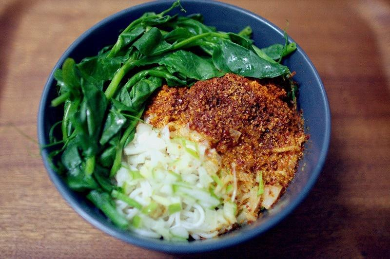

# 油泼面

## 📋 基本資訊 / Recipe Overview
- **料理名稱**：油泼面
- **原始標題**：油泼面
- **素食流派 / Diet**：全素 Vegan
- **料理分類 / Category**：面食主食
- **來源平台 / Source**：[下廚房 · 素食主義專區](https://www.xiachufang.com/recipe/1012997/)

## 🌿 食材及佐料清單 / Ingredients
- 200g面条
- 辣椒面
- 可任选蒜苗（也可加姜末 蒜末）
- 葱
- 1大勺香醋（陈醋会过酸）
- 盐
- 2滴酱油
- 青菜
- 豆芽
- 2大勺油

## 🍳 烹飪步驟 / Step-by-Step Cooking Steps
1. 葱（姜蒜）切末备用，盐、醋、酱油等调味都放在触手可及的地方
2. 水烧开，焯豆芽，断生后捞出过冷水，控干水分铺在碗底（这一步很重要，后面解释）
3. 刚才的水继续烫一小把青菜，捞出后放一边备用
4. 煮面，面条煮的稍微软一些（更好的吸收料汁），但也不要过软，捞出控干水分码在铺好的豆芽上
5. 烧油，至7成左右即可（为了不让面提前捞出发生粘连，所以4.5.这两步一定要统一，即面捞出、调料菜码好，油恰好烧到7成左右），当然，如果喜欢葱花稍有焦味的感觉可烧8成热的油
6. 在面上码盐、葱姜末、辣椒末（保证葱姜和辣椒都可以被热油泼到）
7. 泼完油，立刻（注意这个立刻！）倒醋，如图这一碗大概2汤匙左右，这时候你会听到呲呲的声音，接着就会闻到直逼口水的香气了！最后放少许的酱油调味即可（酱油的量一定要少，吃不出来有酱油，但是有它又会让口味变的丰富有层次）
8. 最后码上烫熟的青菜，拌匀就可以开吃了

## 💡 大廚美味秘訣 / Chef's Tips
- 图上的这一碗面，大概两平勺左右盐（盐袋子里送的那种勺子）醋2汤匙，酱油几滴就可以了（也可以不放）。葱和姜一定要切的尽量细，如果实在不爱吃姜可以不放。油的量跟平常炒一盘菜差不多，也可以多一些。尽量选择质地清爽的油如芥花油、茶油、葵花籽油…… 
豆芽只需要码碗底的量就可以了，如果爱吃可以多来点。碗底码豆芽又要过冷水的两个主要原因，1码面时候的汤渗在最下层的部分不会把面泡烂，2浇醋的时候最下面的面不会把醋吃光。（大部分油泼面比较好吃的馆子都是这么干的！） 
7成的油刚好可以逼出辣椒和葱姜的香味，又不会让两者变糊。 
倒醋的时机，一定要在油泼完的第一时间，和酸汤水饺一个道理，用油的热量烧醋，只留醋香，不要生涩。（哪位有钻研精神的吃货比较一下热油浇醋和油冷之后浇醋的区别就知道啦！） 
青菜可根据个人口味任意选择。 
面条煮好之后一定不要过冷水，趁热才能最好的吸收汤汁。 
如果想丰富一点可以在加个荷包蛋，半熟的蛋黄拌入面里也超级好吃。 
步骤、贴士写的虽然啰嗦点，但是做起来真的挺快的，掌握这些，大概全程15分钟就能做好一碗相当地道油泼面！ 
不写这么长你怎么会明白一碗不需要鸡精味精、芝麻、耗油、老干妈、豆瓣酱等一切曾香提味的调料，仅仅用油盐醋辣椒调味就能把一碗面做的这么香。 
会自己扯面的同学可以放心的出去摆摊了！ 
 
PS：特别强调不需要加什么鸡精味精老干妈豆瓣酱耗油什么的是因为看到不少油泼面菜谱都这么写，实在没忍住必须要说一下，大家做的时候最重要的泼油和倒醋这一步做好了，就差不多成功了。 
 
葱一般来说是必须的，这个对于平时不怎么喜欢吃葱的人来说也可以接受，除非是完全排斥葱的，那就不会喜欢这一口了。 
 
姜末和蒜末放不放都可以，根据自己的口味选择即可。 
 
辣椒面的选择最好是颗粒中等偏细的，完全粉末状的会容易糊，太粗的吃起来有明显的颗粒感，口感不好。未必要追求最正宗的线辣椒面，这个不是哪里都有的，还是那句话，这道菜谱最关键的点是泼油和倒醋，当然如果你有线辣椒面肯定是最好的了。 
 
醋的选择，我用的是镇江香醋，2汤匙，趁热泼下去不会觉得面很酸，但是香。不爱吃醋的同学也是完全可以接受的，如果没有趁热泼，那这个量就会觉得酸了。如果做过觉得这个量不合口味，那就根据个人喜欢稍作调整。 
 
另外，大家提到的加花椒面，如果可以请试着自己做，一小撮花椒放进保鲜袋用擀面杖压碎，然后过滤掉大颗粒，可再重复以上动作，直到花椒都磨成粉面。码菜和调料的时候一起放就行。 
 
还有大家说的油泼辣子拌面和油泼面不是一个东西，做法不同味道也不同。 
我曾经试验过一次所有材料都一样，只是把泼油这一步变成辣椒和葱倒进油里然后再拌面，就和正常方法做的油泼面味道有非常明显的差别，感觉都完全不同。 
 
最后再说下油泼面的基本版吧。 
豆芽做底，扯面或棍棍面煮熟入碗。码盐、辣椒、葱末。热油泼，趁热倒醋，码菜，拌匀。 
 
这个基础上可选择的常见项目有加姜蒜、花椒粉、少许酱油、荷包蛋、或其他面卤，西安常见的二合一有油泼面加西红柿鸡蛋卤。 
 
以上做成功，你都舍不得给面里再加其他乱七八糟的复合调味料了。

---
*食譜歸檔時間：2026-08-20 · 來源：下廚房 (www.xiachufang.com)*